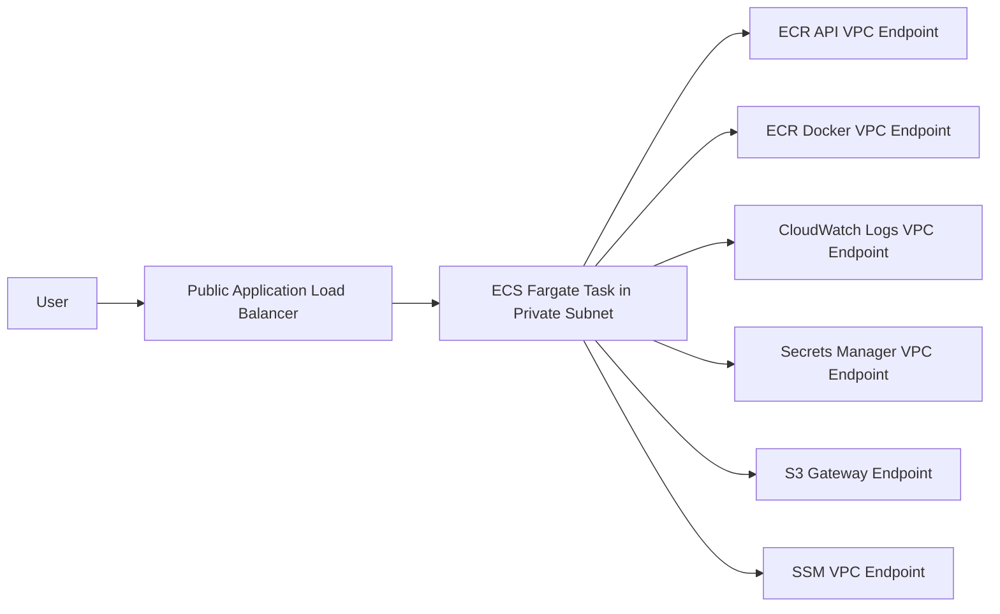

# Private VPC ECS Fargate Platform

This project shows how to run an ECS Fargate service in private subnets without giving tasks public IPs and without depending on a NAT gateway for image pulls, logs, secrets, and runtime AWS API calls.

The project is based on a real production-style problem: ECS tasks in private subnets failing with `ResourceInitializationError` because the task could not reach ECR, CloudWatch Logs, S3, or Secrets Manager during startup.

## What This Builds

- VPC with public and private subnets across two Availability Zones.
- Internet Gateway for public ingress.
- Application Load Balancer in public subnets.
- ECS Fargate service in private subnets.
- ECR repository for the application image.
- CloudWatch log group for container logs.
- ECS task execution role with the permissions required to pull images and write logs.
- VPC interface endpoints for:
  - ECR API
  - ECR Docker registry
  - CloudWatch Logs
  - Secrets Manager
  - SSM
- VPC gateway endpoint for S3.
- Security groups that allow only the traffic required for ALB-to-task and task-to-endpoint communication.

## Architecture



## Why This Matters

A common beginner mistake is to place ECS tasks in private subnets and assume they can still pull images from ECR. Private subnets do not have direct internet access. If there is no NAT gateway and no VPC endpoints, the task fails before the application even starts.

The error usually looks like this:

```text
ResourceInitializationError: unable to pull secrets or registry auth
```

or:

```text
ResourceInitializationError: failed to pull image
```

The clean fix is to design the network intentionally:

- Keep workloads private.
- Expose only the ALB publicly.
- Use VPC endpoints for AWS service access.
- Avoid NAT gateway cost when the application does not need general outbound internet access.

## Folder Structure

```text
01-private-vpc-ecs-fargate/
├── README.md
├── architecture.mmd
├── app/
│   ├── Dockerfile
│   └── server.js
├── github-actions/
│   └── ecs-deploy.yml
└── terraform/
    ├── main.tf
    ├── outputs.tf
    ├── terraform.tfvars.example
    ├── variables.tf
    └── versions.tf
```

## Prerequisites

- AWS CLI configured with a non-production account.
- Terraform `>= 1.6`.
- Docker.
- An IAM identity that can create VPC, ECS, ECR, IAM, ALB, and CloudWatch resources.

## Deploy

From the `terraform` folder:

```bash
terraform init
terraform plan -out=tfplan
terraform apply tfplan
```

Build and push the sample image:

```bash
aws ecr get-login-password --region ap-south-1 \
  | docker login --username AWS --password-stdin <account-id>.dkr.ecr.ap-south-1.amazonaws.com

docker build -t private-vpc-ecs-demo ../app
docker tag private-vpc-ecs-demo:latest <repository-url>:latest
docker push <repository-url>:latest
```

Update the ECS service after pushing the image:

```bash
aws ecs update-service \
  --cluster private-vpc-ecs-demo \
  --service private-vpc-ecs-demo \
  --force-new-deployment \
  --region ap-south-1
```

## Validate

Check task status:

```bash
aws ecs list-tasks --cluster private-vpc-ecs-demo --region ap-south-1
aws ecs describe-tasks --cluster private-vpc-ecs-demo --tasks <task-arn> --region ap-south-1
```

Check logs:

```bash
aws logs tail /ecs/private-vpc-ecs-demo --follow --region ap-south-1
```

Open the ALB DNS name from Terraform outputs:

```bash
terraform output alb_dns_name
```

## Troubleshooting Notes

### Task cannot pull image

Check these items first:

- ECR API endpoint exists.
- ECR Docker endpoint exists.
- S3 gateway endpoint exists.
- ECS task execution role has ECR permissions.
- Endpoint security group allows inbound `443` from the ECS task security group.
- Private route table is associated with the private subnets.

### Task starts but logs are missing

Check:

- CloudWatch Logs endpoint exists.
- Task execution role has `logs:CreateLogStream` and `logs:PutLogEvents`.
- Log group name in task definition matches the Terraform-created log group.

### ALB health check fails

Check:

- Container listens on port `3000`.
- Target group health check path is `/health`.
- ECS service security group allows inbound traffic from the ALB security group.

## Cost Notes

This design avoids NAT gateway hourly and data processing charges for workloads that only need AWS service access. VPC interface endpoints also have cost, so the tradeoff should be checked for each workload. For small private ECS services, endpoints can be cheaper and more controlled than keeping NAT only for ECR/logs/secrets traffic.

## Cleanup

```bash
terraform destroy
```

Delete any manually pushed ECR images if Terraform cannot remove the repository because it is not empty.
