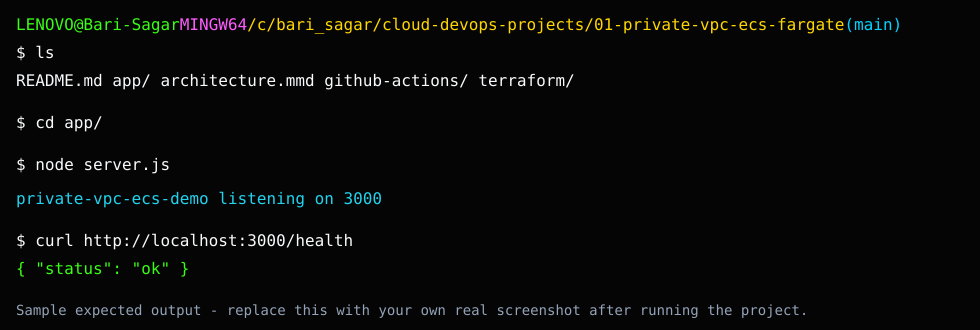

# Private VPC ECS Fargate Screenshot Checklist

## Sample Expected Output

This image is a sample expected-output reference. Replace it with your own real screenshot after running the project.

Capture:

- `01-local-app-run.png`: Node app running locally.
- `02-docker-build.png`: Docker image build success.
- `03-terraform-validate.png`: Terraform validation success.
- `04-terraform-plan.png`: Terraform plan output.
- `05-ecr-repository.png`: ECR repository after image push.
- `06-ecs-service-running.png`: ECS service stable.
- `07-task-private-subnet.png`: task networking view showing private subnet.
- `08-vpc-endpoints.png`: required endpoints created.
- `09-alb-working.png`: ALB DNS responding.
- `10-cloudwatch-logs.png`: application logs in CloudWatch.

Blur account IDs, private ARNs, public IPs, access keys, office domains, and customer names before publishing screenshots.
