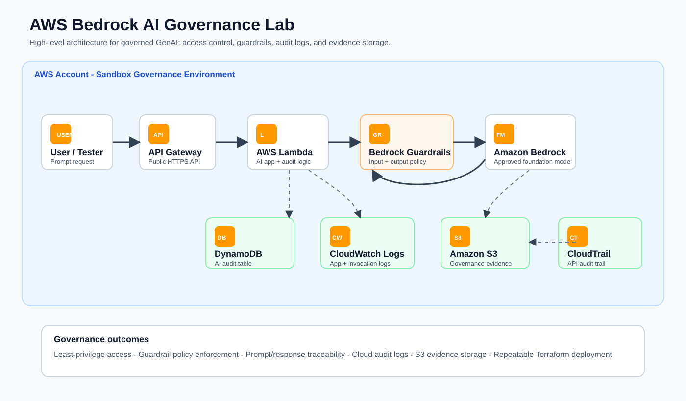
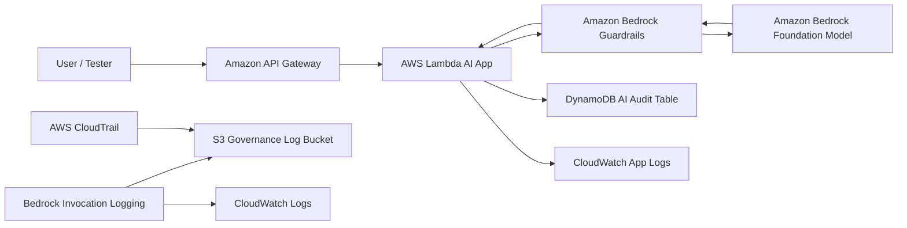

# AWS Bedrock AI Governance Lab

Reference implementation for a governed generative AI API on AWS.

The project deploys a serverless application that invokes Amazon Bedrock through Bedrock Guardrails and stores governance evidence with AWS-native logging, audit, and security services.

## What This Builds

- API Gateway endpoint for a small AI assistant API.
- Lambda function that calls Amazon Bedrock using the Converse API.
- Amazon Bedrock Guardrail for input and output governance.
- DynamoDB table for application-level AI audit records.
- CloudWatch log group for Lambda runtime logs.
- S3 bucket for Bedrock model invocation logs and governance evidence.
- CloudTrail trail for API-level audit visibility.
- IAM roles and policies using least-privilege patterns.
- Governance test prompts for safe requests, PII, prompt injection, and restricted topics.

## High-Level Architecture





## End-to-End Governance Flow

1. A user sends a prompt to API Gateway.
2. API Gateway invokes the Lambda application.
3. Lambda records request metadata and calls Amazon Bedrock with a configured guardrail.
4. Bedrock Guardrails evaluate the user input before model inference.
5. If the prompt is unsafe, the guardrail blocks the request and the model is not invoked.
6. If the prompt is allowed, Bedrock invokes the approved foundation model.
7. The model response is evaluated by the guardrail before returning to the application.
8. Lambda stores an audit record in DynamoDB and writes logs to CloudWatch.
9. Bedrock invocation logging stores model request/response metadata in S3 and CloudWatch Logs.
10. CloudTrail records API activity for governance and investigation.

## Governance Controls Covered

| Control Area | AWS Service | What It Proves |
| --- | --- | --- |
| Identity and access | IAM | Only approved roles can invoke Bedrock and write audit logs. |
| Input safety | Bedrock Guardrails | Unsafe prompts, prompt attacks, PII, and denied topics can be blocked or masked. |
| Output safety | Bedrock Guardrails | Model responses are evaluated before being returned to the user. |
| Application audit | DynamoDB | Each request stores metadata for traceability. |
| Runtime logs | CloudWatch Logs | Lambda behavior and errors are visible. |
| Model invocation logs | Bedrock logging, S3, CloudWatch | Prompt and response activity can be reviewed based on logging configuration. |
| API audit | CloudTrail | AWS API calls are recorded for investigation. |
| Data protection | S3 encryption, IAM | Logs and evidence are stored with encryption and access control. |

## Prerequisites

- AWS CLI configured with a personal sandbox AWS account.
- Terraform `>= 1.6`.
- Python `>= 3.10`.
- Amazon Bedrock model access enabled in your target region.
- An IAM identity that can create Lambda, API Gateway, IAM, S3, CloudWatch, CloudTrail, DynamoDB, and Bedrock Guardrails resources.

## Deploy

From the `terraform` folder:

```bash
terraform init
terraform validate
terraform plan -out=tfplan
terraform apply tfplan
```

After deployment, copy the API endpoint:

```bash
terraform output api_endpoint
```

## Test Governance Behavior

Run the governance prompt suite:

```bash
cd tests
python run_governance_tests.py --endpoint <api-endpoint>
```

The test suite sends safe prompts, prompt injection attempts, PII-style inputs, and restricted-advice requests.

## Evidence Screenshots

See [Deployment Evidence](./docs/deployment-evidence.md) for redacted screenshots from a real sandbox deployment.

See [screenshots/README.md](./screenshots/README.md) for the screenshot checklist used during deployment.

## Cleanup

```bash
terraform destroy
```

Some S3 buckets may need to be emptied before Terraform can delete them.
