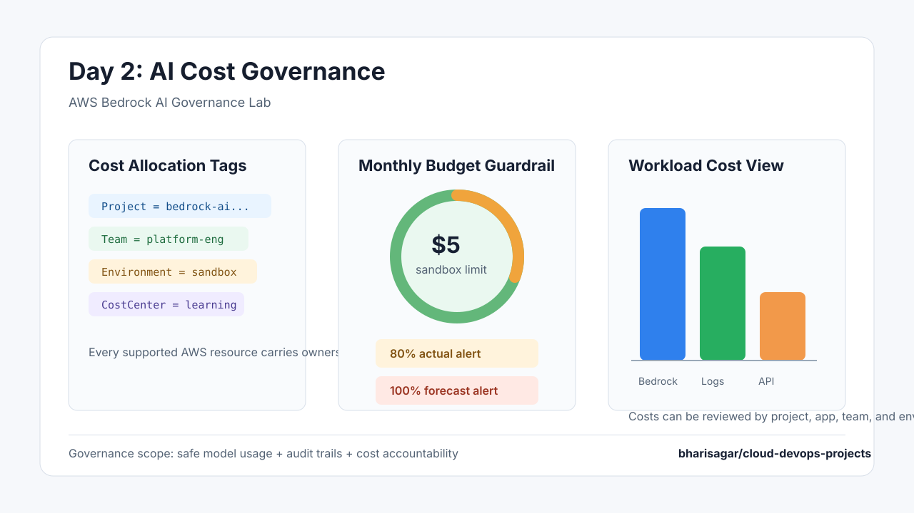

# Day 2: AI Cost Governance

Day 1 proved that the Bedrock application can be governed with IAM, Guardrails, CloudWatch, CloudTrail, DynamoDB, and encrypted evidence storage.

Day 2 adds cost accountability. In a real company, AI governance should also answer who owns the workload, which environment is spending money, and when spend is trending above the sandbox limit.

## What Changed

- Added cost allocation tags to all supported Terraform-managed resources.
- Added ownership tags for `Application`, `Environment`, `Team`, `CostCenter`, and `Owner`.
- Added an optional monthly AWS Budget for the lab.
- Added actual and forecasted alert thresholds.
- Added Terraform outputs that show the active cost-governance tags.

## Cost Governance Controls

| Control | Implementation | Why It Matters |
| --- | --- | --- |
| Workload tagging | `local.common_tags` in Terraform | Makes AI workload ownership visible. |
| Environment tracking | `environment` variable | Separates sandbox, staging, and production spend. |
| Team ownership | `team_name` variable | Supports chargeback or showback conversations. |
| Cost center mapping | `cost_center` variable | Connects technical resources to business accountability. |
| Budget threshold | `aws_budgets_budget` | Alerts before sandbox experiments become surprise bills. |
| Forecast alert | Forecasted budget notification | Warns when usage trend may cross the limit. |

## Terraform Inputs

```hcl
environment              = "sandbox"
team_name                = "platform-engineering"
cost_center              = "learning-lab"
owner                    = "bharisagar"
monthly_budget_limit_usd = 5
budget_alert_email       = "you@example.com"
```

`budget_alert_email` is optional. If it is empty, Terraform skips creating the AWS Budget so the lab can still be deployed without email configuration.

## Governance Evidence



The cost governance layer gives the lab three practical controls: ownership tags for every supported resource, a monthly budget threshold for sandbox usage, and a cost allocation model that can be reviewed by workload, team, environment, and cost center.

Additional implementation evidence:

- [Cost allocation tags](../screenshots/evidence/11-day2-cost-tags-implementation.svg)
- [Monthly budget guardrail](../screenshots/evidence/12-day2-budget-control.svg)
- [Terraform validation](../screenshots/evidence/13-day2-terraform-validate.svg)

## Real-World Pattern

In an enterprise setup, each AI app should have:

- A named project or workload boundary.
- Mandatory tags for application, owner, team, environment, and cost center.
- Budget alerts for sandbox and production.
- Cost Explorer reports grouped by AI workload.
- A review process when usage crosses the forecasted threshold.

This turns AI governance from only "is the model safe?" into "is the model safe, observable, auditable, and financially accountable?"
