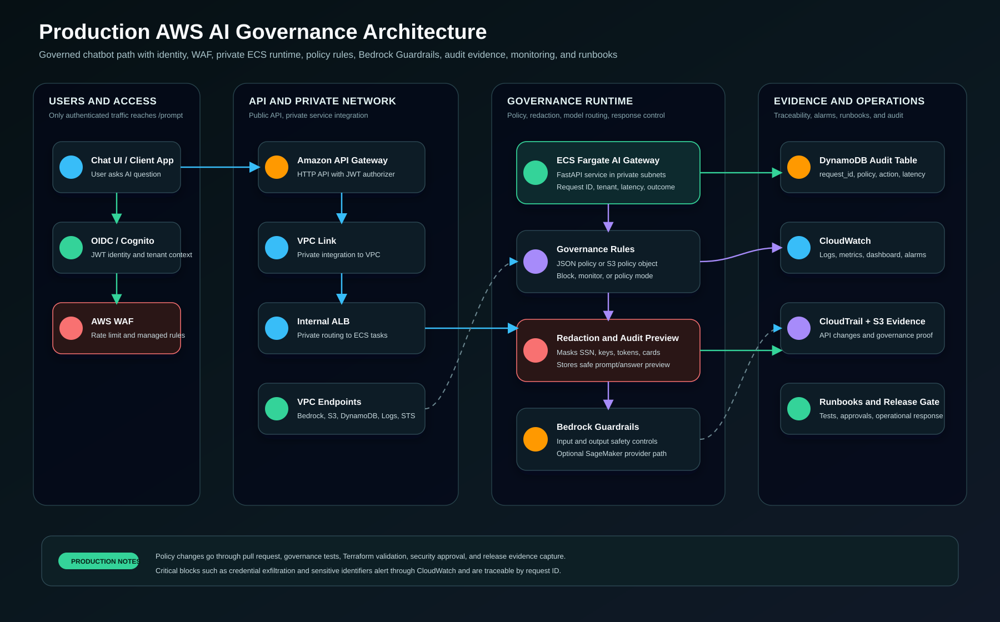
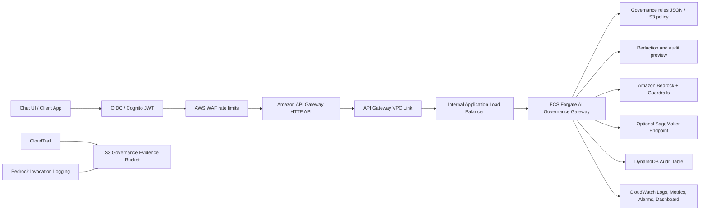

# AWS Enterprise AI Governance Platform on ECS

Organization-level reference architecture for a governed AI API on AWS.

This project moves the earlier Lambda governance lab into an enterprise container pattern using Amazon ECS on Fargate, API Gateway, private networking, Bedrock Guardrails, DynamoDB audit records, CloudWatch monitoring, CloudTrail, S3 evidence storage, and Terraform.

The design is intentionally prepared for a Bedrock vs SageMaker comparison. The same governance API can call Amazon Bedrock managed foundation models or a SageMaker endpoint for customer-owned/custom models.

Recommended model choices:

- Bedrock baseline: Amazon Nova Pro through `apac.amazon.nova-pro-v1:0`.
- Bedrock cost-optimized option: Amazon Nova Lite through `apac.amazon.nova-lite-v1:0`.
- Bedrock advanced reasoning option: Claude Sonnet 4.6 through `anthropic.claude-sonnet-4-6` or the available regional inference profile when long-context analysis is required and the higher token cost is accepted.
- SageMaker smoke-test option: a custom lightweight endpoint on `ml.m5.large` to prove SageMaker Runtime integration at low cost.
- SageMaker LLM option after GPU quota approval: a supported JumpStart text-generation endpoint such as Gemma 3 1B Instruct on `ml.g5.2xlarge` or Llama3 8B SEA-Lion v2.1 Instruct on `ml.g5.4xlarge`.

## What This Builds

- Public Amazon API Gateway HTTP API for controlled customer/app access.
- Browser-based governance chat console for manager and operations demos.
- API Gateway VPC Link into a private VPC.
- Internal Application Load Balancer for ECS service routing.
- ECS Fargate service running a containerized FastAPI AI governance gateway.
- Amazon Bedrock Guardrail for prompt and response governance.
- Optional SageMaker endpoint invocation path for custom model and runtime demos.
- DynamoDB audit table for request, policy, model, latency, and outcome records.
- CloudWatch Logs, dashboards, and alarms for application and platform monitoring.
- CloudTrail and S3 evidence bucket for audit and governance proof.
- Private VPC endpoints for ECR, CloudWatch Logs, Bedrock Runtime, S3, DynamoDB, and STS.
- IAM roles using least-privilege boundaries for ECS task execution and AI runtime access.
- Optional AWS Budget guardrail for sandbox spend control.

## Architecture





## Why ECS Instead of Lambda

| Area | Lambda version | ECS version |
| --- | --- | --- |
| Best fit | Lightweight serverless API | Enterprise application platform |
| Runtime ownership | Function code only | Full container image and runtime |
| Scaling model | Event-driven concurrency | Service desired count and autoscaling |
| Networking story | API Gateway to Lambda | API Gateway to private VPC Link and ECS |
| Operations story | Lambda logs and metrics | ECS service health, ALB metrics, container logs, autoscaling |
| AI platform comparison | Good for Bedrock API demo | Better for Bedrock vs SageMaker side-by-side |

## Demo Modes

The container supports three AI provider modes:

- `demo`: deterministic local responses, safe for screenshots and dry runs.
- `bedrock`: invokes Amazon Bedrock through the Converse API and Bedrock Guardrails.
- `sagemaker`: invokes a configured SageMaker endpoint through SageMaker Runtime.

Start with `demo` for a predictable walkthrough, then switch to `bedrock` after model access, quotas, and cost controls are confirmed.

## Project Structure

```text
03-aws-enterprise-ai-governance-ecs/
  app/                 Containerized FastAPI governance service
  sagemaker-smoke/     Low-cost SageMaker Runtime smoke-test container
  terraform/           AWS infrastructure as code
  tests/               API governance test runner
  docs/                Architecture, customer approach, cost, monitoring, and solution walkthrough
  assets/              Architecture diagram
```

## Local App Test

```bash
cd app
python -m venv .venv
.venv\Scripts\activate
pip install -r requirements.txt
$env:AI_PROVIDER="demo"
$env:APP_POLICY_MODE="enforce"
uvicorn main:app --host 0.0.0.0 --port 8080
```

Open the local governance chat console:

[http://127.0.0.1:8080/](http://127.0.0.1:8080/)

The console lets a reviewer send a safe question, prompt injection attempt, or PII test and immediately see:

- `governance_action`
- `policy_rule`
- `stop_reason`
- `request_id`
- audit status
- monitoring stream
- evidence lookup path
- active governance rules loaded from `app/policies/governance-rules.json`

## Governance Rule Configuration

Organization-specific rules live in:

[app/policies/governance-rules.json](./app/policies/governance-rules.json)

Each rule has:

- `name`: stable rule ID written to logs and audit records
- `description`: human-readable purpose
- `action`: `block`, `monitor`, or `policy_mode`
- `pattern`: case-insensitive regular expression used by the gateway

`policy_mode` follows `APP_POLICY_MODE`:

- `APP_POLICY_MODE=enforce` returns `blocked`
- `APP_POLICY_MODE=monitor` returns `monitored`

Rules such as credential exfiltration and sensitive identifiers use `action=block` so they are blocked even when the wider environment is in monitor mode.

The active rule list is available from:

```text
GET /governance/rules
```

For production, set one of these:

- `publish_governance_rules_to_s3 = true` to publish the bundled policy to the encrypted evidence bucket.
- `governance_rules_s3_uri = "s3://central-policy-bucket/path/governance-rules.json"` to load an externally managed policy object.

Use `enable_jwt_authorizer = true` with `jwt_issuer` and `jwt_audience` before exposing the API to users. Keep `enable_waf = true` for rate limiting and common managed protections.

Test:

```bash
python ..\tests\run_governance_tests.py --endpoint http://127.0.0.1:8080
```

## AWS Deployment

Start with the deployment guide:

[docs/deployment-guide.md](./docs/deployment-guide.md)

Recommended flow:

1. Create the ECR repository with Terraform.
2. Build and push the container image.
3. Deploy ECS, API Gateway, guardrails, audit, logging, and monitoring.
4. Run governance tests.
5. Capture evidence screenshots.
6. Destroy sandbox resources when the demo is complete.

## Deployment Evidence

Live AWS evidence from the June 10, 2026 sandbox deployment is captured in:

[docs/evidence.md](./docs/evidence.md)

The evidence covers ECS Fargate service health, running tasks, ECR image delivery, internal ALB routing, Bedrock Guardrail readiness, and the SageMaker Runtime smoke-test path.

## Solution Documents

- [Solution architecture](./docs/solution-architecture.md)
- [Customer approach](./docs/customer-approach.md)
- [Bedrock vs SageMaker](./docs/bedrock-vs-sagemaker.md)
- [Security, monitoring, and latency](./docs/security-monitoring-latency.md)
- [Manager demo guide](./docs/demo-guide.md)
- [Operational runbooks](./docs/runbooks.md)
- [Production readiness guide](./docs/production-readiness.md)
- [Cost model](./docs/cost-model.md)
- [Deployment evidence](./docs/evidence.md)
- [SageMaker runtime smoke test](./docs/sagemaker-smoke-test.md)
- [Live validation notes - 2026-06-10](./docs/live-validation-2026-06-10.md)
- [Solution walkthrough](./docs/solution-walkthrough.md)

## Cleanup

```bash
cd terraform
terraform destroy
```

For sandbox work, do not leave ECS services, ALBs, VPC endpoints, CloudTrail, or model endpoints running after the demo.
