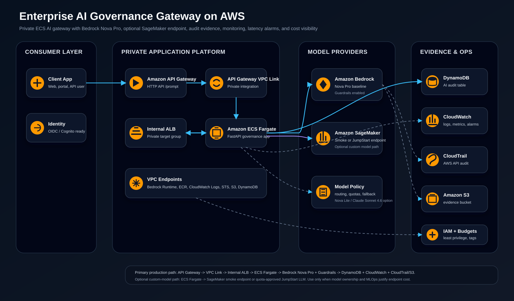

# Solution Architecture

## Architecture Name

Enterprise AI Governance Gateway on AWS.

## Problem

Organizations adopting AI need more than model access. They need a governed access layer that controls who can call AI, which model is used, what data is allowed, how unsafe prompts are handled, what latency users experience, and what evidence is available for security review.

This project builds that governed access layer with AWS-native services.

## What This Project Builds

- API Gateway HTTP API as the managed public API entry point.
- API Gateway VPC Link into a private VPC.
- Internal Application Load Balancer for private ECS routing.
- ECS Fargate service running a FastAPI AI governance gateway.
- Amazon Bedrock integration using Amazon Nova Pro as the baseline model.
- Bedrock Guardrails for content filtering, prompt attack protection, sensitive information handling, and denied topics.
- Optional SageMaker endpoint integration for a custom model path using Llama 3.1 8B Instruct.
- DynamoDB audit table for request-level governance records.
- CloudWatch logs, dashboard, and alarms for operations.
- CloudTrail and S3 evidence bucket for AWS API audit.
- Interface VPC endpoints for private AWS service access.
- Terraform for repeatable deployment and cleanup.

## Target Architecture

## Request Flow

1. A client sends `POST /prompt` to API Gateway.
2. API Gateway forwards the request through VPC Link.
3. The internal ALB routes the request to the ECS Fargate service.
4. The container creates a `request_id` and evaluates application-side policy rules.
5. The container invokes the selected provider:
   - `AI_PROVIDER=bedrock`: calls Amazon Bedrock Converse API using Nova Pro and Bedrock Guardrails.
   - `AI_PROVIDER=sagemaker`: calls a SageMaker Runtime endpoint hosting Llama 3.1 8B Instruct.
   - `AI_PROVIDER=demo`: returns deterministic local responses for safe validation.
6. The app writes request metadata to DynamoDB.
7. CloudWatch captures structured logs and platform metrics.
8. CloudTrail records AWS API activity into the S3 evidence bucket.

## Governance Flow

| Stage | Control |
| --- | --- |
| API access | API Gateway boundary, future JWT/OIDC authorizer, throttling, WAF-ready design |
| Private routing | VPC Link, internal ALB, private ECS tasks |
| Runtime identity | ECS task role with scoped permissions |
| Input policy | Local prompt checks plus Bedrock Guardrails |
| Model selection | Explicit provider and model configuration |
| Output handling | Guardrail evaluation and safe fallback responses |
| Audit record | DynamoDB item per request |
| Logs and metrics | CloudWatch structured logs, dashboard, and alarms |
| AWS API audit | CloudTrail to encrypted S3 evidence bucket |
| Cost control | Tags, budget variable, model cost table, cleanup guide |

## Model Architecture

| Provider | Model | Role |
| --- | --- | --- |
| Bedrock | Amazon Nova Pro | Default enterprise GenAI model for governed assistant responses |
| Bedrock | Amazon Nova Lite | Cost-optimized model for simple/high-volume requests |
| Bedrock | Claude Sonnet 4.6 | Advanced reasoning option through `anthropic.claude-sonnet-4-6` or an available regional inference profile |
| SageMaker | Meta Llama 3.1 8B Instruct | Custom-model path for MLOps, Model Registry, endpoint operations, and model monitoring |

## Security Design

- No public ECS tasks.
- No direct public ALB access.
- API Gateway is the only public entry point.
- ECS task role owns model and audit access.
- VPC endpoints reduce public internet dependency.
- S3 bucket blocks public access and uses server-side encryption.
- DynamoDB uses point-in-time recovery and server-side encryption.
- CloudTrail records control-plane actions.

## Monitoring Design

- ALB target response time alarm for latency.
- ALB 5xx alarm for backend failures.
- ECS CPU alarm for saturation.
- CloudWatch dashboard for service health.
- Structured logs include request ID, tenant, provider, governance action, and latency.
- DynamoDB audit records can be queried for blocked requests and policy actions.

## Latency Design

Expected latency depends mostly on the model path:

- Demo mode: usually milliseconds after API/ALB/ECS routing.
- Bedrock Nova Lite: lower latency and lower cost for simple prompts.
- Bedrock Nova Pro: stronger reasoning with moderate model latency.
- Claude Sonnet 4.6: higher reasoning quality, typically higher token cost and potentially higher latency.
- SageMaker Llama 3.1 8B endpoint: predictable endpoint latency when the GPU endpoint is warm, but endpoint cost is always-on for real-time inference.

## Production Enhancements

- Add JWT/OIDC authorizer to API Gateway.
- Add AWS WAF for external traffic.
- Add request/response schema validation.
- Add tenant-specific model routing.
- Add CloudWatch metric filters for blocked requests.
- Add X-Ray/OpenTelemetry tracing.
- Add CI/CD pipeline with image scanning and policy checks.
- Add SageMaker Model Registry approval workflow for custom models.
- Send security logs to a centralized audit account.
