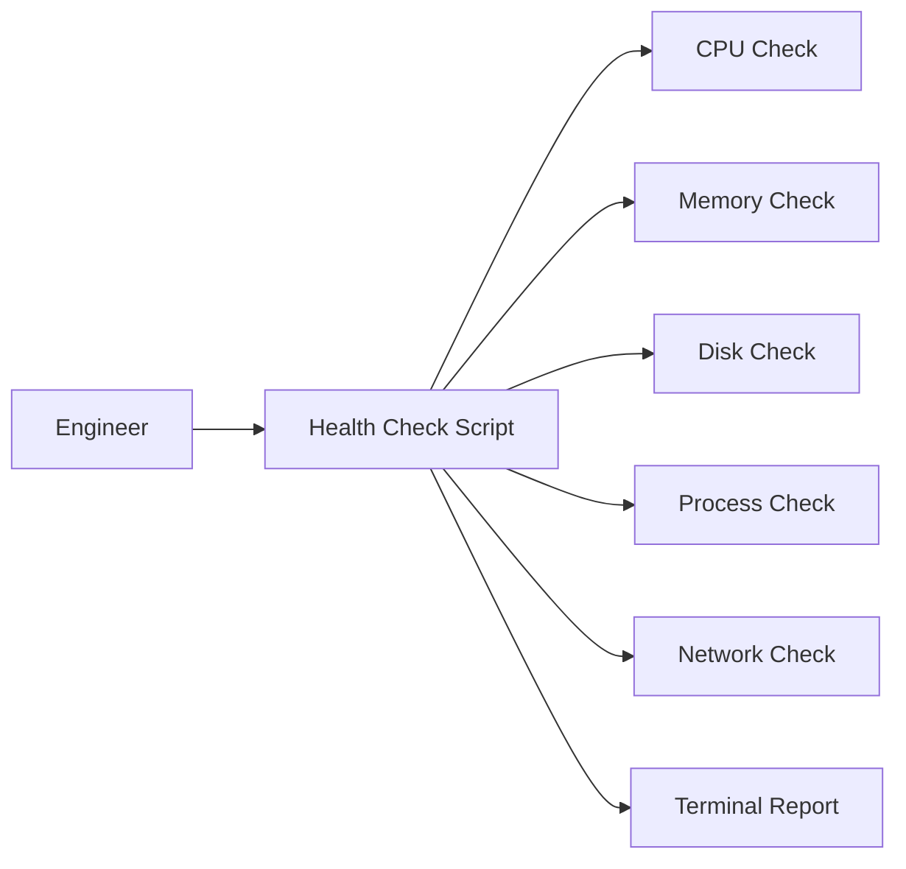

# Day 1: Linux Server Health Check Automation

## What We Are Building

Today we build a simple server health check script.

This is not a fancy project, but it is one of the most practical starting points in DevOps. Before Kubernetes, Terraform, CI/CD, or cloud architecture, an engineer should understand what is happening on a machine.

When I troubleshoot any server, I usually start with these questions:

- Is CPU under pressure?
- Is memory almost full?
- Is disk usage dangerous?
- Is the expected process running?
- Is the service port listening?
- Is the machine reachable on the network?
- Is there enough information to explain the issue to someone else?

This project turns those checks into a repeatable script.

## Why This Project Matters

A lot of beginners directly jump into Kubernetes and Terraform. That is exciting, but when something fails, the first clues still come from Linux basics.

For example:

- A container can crash because the host is out of disk.
- A deployment can fail because a port is already used.
- A pipeline can fail because the runner does not have enough memory.
- An EC2 instance can look healthy in AWS but still have a full root volume.

DevOps is not only about creating infrastructure. It is about operating systems with confidence.

## Architecture



## Folder Structure

```text
day-01-linux-server-health-check/
├── README.md
├── architecture.mmd
├── sample-output.txt
├── scripts/
│   ├── server-health-check.sh
│   └── server-health-check.ps1
└── screenshots/
    └── README.md
```

## Prerequisites

For Linux, macOS, Git Bash, or WSL:

```bash
bash --version
```

For Windows PowerShell:

```powershell
$PSVersionTable.PSVersion
```

## Run on Linux, WSL, or Git Bash

```bash
cd 30-days-cloud-devops-projects/day-01-linux-server-health-check
chmod +x scripts/server-health-check.sh
./scripts/server-health-check.sh
```

Optional: check a specific process and port.

```bash
PROCESS_NAME=node PORT=3000 ./scripts/server-health-check.sh
```

## Run on Windows PowerShell

```powershell
cd C:\bari_sagar\devops-real-projects\30-days-cloud-devops-projects\day-01-linux-server-health-check
.\scripts\server-health-check.ps1
```

Optional:

```powershell
.\scripts\server-health-check.ps1 -ProcessName node -Port 3000
```

## What to Capture as Evidence

Take screenshots of:

1. The script running successfully.
2. Disk, memory, and CPU output.
3. A process check that passes.
4. A process check that fails.
5. Your `sample-output.txt` or terminal output.

## Break It Intentionally

Run a check for a process that does not exist.

```bash
PROCESS_NAME=this-process-does-not-exist ./scripts/server-health-check.sh
```

You should see a warning. This is good. A useful health check does not hide problems.

## Common Troubleshooting

### Permission denied

Run:

```bash
chmod +x scripts/server-health-check.sh
```

### `ss` command not found

Some systems do not include `ss`. Try:

```bash
netstat -tuln
```

The script already falls back where possible.

### PowerShell script blocked

Run PowerShell as your user and allow the current process:

```powershell
Set-ExecutionPolicy -Scope Process -ExecutionPolicy Bypass
```

## Interview Explanation

You can explain this project like this:

> I built a server health check automation script that collects CPU, memory, disk, process, and port status. The goal was to make basic Linux troubleshooting repeatable. This is useful before deployments, during incidents, and while validating servers after changes.

## Next Improvement

Add log file output:

```bash
./scripts/server-health-check.sh | tee health-report.log
```

In a production setup, this kind of script can be scheduled using cron and integrated with Slack, email, CloudWatch, or Prometheus exporters.
