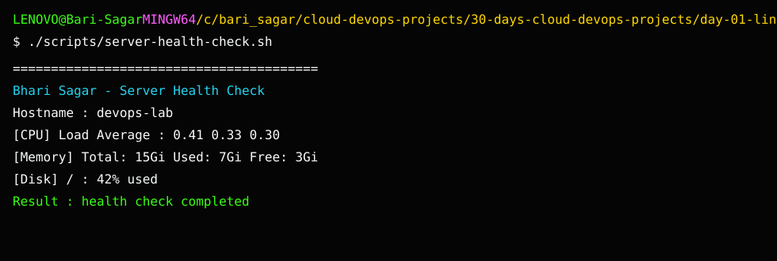

# Day 1 Screenshot Checklist

## Project output

This screenshot shows the completed project output used for verification.

Capture these screenshots:

- `01-script-run-success.png`: full terminal output after running the script.
- `02-process-running.png`: process check passing for a real process.
- `03-process-not-running.png`: process check failing for a fake process.
- `04-port-check.png`: port check output.
- `05-final-github-folder.png`: GitHub folder after pushing your project.

Do not upload screenshots that show private company hostnames, internal IP addresses, VPN details, or access tokens.
