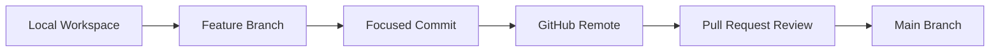
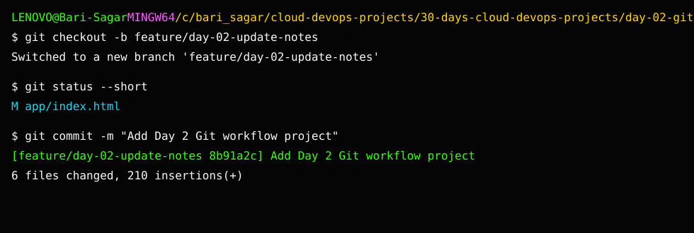

# Day 2: Git and GitHub Workflow Project

## What We Are Building

Today we build a tiny static DevOps notes page and use it to practice a professional Git workflow.

This is not about learning every Git command. It is about learning the daily rhythm engineers use:

- create a branch
- make a focused change
- commit with a meaningful message
- compare changes
- write release notes
- push to GitHub
- review before merging

I have seen many beginners know Docker commands but struggle when asked to work in a team repo. Git discipline matters because almost every DevOps activity starts from code: Terraform, Helm charts, pipelines, Dockerfiles, scripts, and documentation.

## Project Outcome

By the end of this day, you will have:

- a small static website
- a feature branch
- clean commits
- a changelog
- a pull-request style summary
- screenshots as evidence

## Theory: Why Git Workflow Matters in DevOps

Git is not only for application developers. In DevOps, almost everything important becomes code.

Examples:

- Terraform files create infrastructure.
- Dockerfiles define application runtime.
- Kubernetes YAML controls deployments.
- GitHub Actions files control CI/CD.
- Bash scripts automate operations.
- Markdown files document runbooks.

Because of this, a careless Git change can break real systems. A professional workflow reduces that risk.

### Branch

A branch gives you a safe place to work. Instead of changing `main` directly, you isolate your change and make it reviewable.

### Commit

A commit is a checkpoint. A good commit should explain one clear change. If something breaks later, the team can inspect or revert that commit.

### Diff

The diff is your first review. Before asking another person to review your work, read your own changes. This habit catches mistakes early.

### Pull Request

A pull request is not just a button in GitHub. It is a communication document. It should explain what changed, how it was tested, and what risk exists.

## Architecture



## Folder Structure

```text
day-02-git-github-workflow/
├── README.md
├── app/
│   ├── index.html
│   ├── styles.css
│   └── app.js
├── docs/
│   ├── git-workflow.md
│   └── release-notes.md
└── screenshots/
    └── README.md
```

## Project Output Screenshot



## Run the App Locally

Open the file directly in your browser:

```text
app/index.html
```

Or serve it with Python:

```bash
cd 30-days-cloud-devops-projects/day-02-git-github-workflow/app
python -m http.server 8080
```

Open:

```text
http://localhost:8080
```

## Practice Workflow

From the repository root:

```bash
git checkout -b feature/day-02-update-notes
git status
```

Make a small change in:

```text
app/index.html
```

Then check what changed:

```bash
git diff
git status
```

Commit:

```bash
git add 30-days-cloud-devops-projects/day-02-git-github-workflow
git commit -m "Add Day 2 Git workflow project"
```

Push:

```bash
git push -u origin feature/day-02-update-notes
```

## What a Good Commit Looks Like

Good:

```text
Add Day 2 Git workflow project
Fix health check script port detection
Document Docker build troubleshooting
```

Weak:

```text
changes
update
final final
```

Your commit message should help another engineer understand why the change exists.

## Pull Request Summary Template

Use this format:

```markdown
## Summary
- Added a static DevOps notes page.
- Documented Git workflow commands.
- Added screenshot checklist.

## Validation
- Opened app/index.html locally.
- Verified links and layout.
- Reviewed git diff before commit.

## Risk
- Documentation-only and static HTML changes.
```

## Break It Intentionally

Try this:

1. Modify `app/index.html`.
2. Run `git diff`.
3. Undo only one line manually.
4. Run `git diff` again.

This teaches you to inspect your own work before pushing.

## Troubleshooting

### I am on the wrong branch

```bash
git branch
git switch main
```

### I committed too early

If the commit is local and not pushed:

```bash
git commit --amend
```

### I want to see previous commits

```bash
git log --oneline --decorate --graph -5
```

## Interview Explanation

> I created a small project to practice a clean Git workflow. I used a feature branch, made focused commits, reviewed the diff, wrote release notes, and prepared a pull-request style summary. This helped me practice how DevOps engineers manage infrastructure and automation changes safely.

## Evidence

Capture:

- branch creation
- `git status`
- `git diff`
- local app running
- GitHub branch or PR screen
