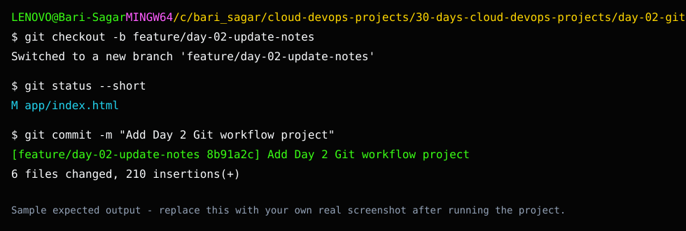

# Day 2 Screenshot Checklist

## Sample Expected Output

This image is a sample expected-output reference. Replace it with your own real screenshot after running the project.

Capture:

- `01-feature-branch.png`: terminal showing your feature branch.
- `02-git-diff.png`: terminal showing a focused diff.
- `03-local-page.png`: browser showing the static page.
- `04-commit-log.png`: `git log --oneline` output.
- `05-github-branch-or-pr.png`: GitHub branch or pull request screen.

Avoid screenshots with private repository tokens, email inboxes, or internal company names.
