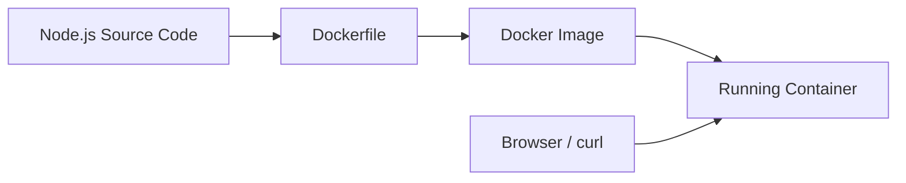
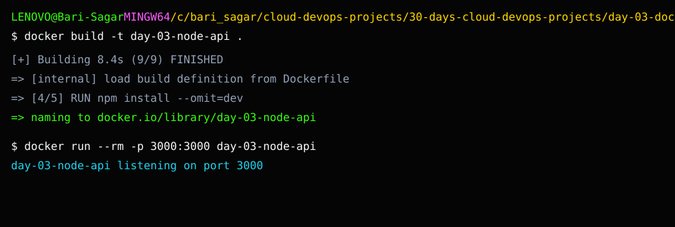

# Day 3: Dockerize a Node.js App

## What We Are Building

Today we create a small Node.js API and package it as a Docker image.

This is the first real container project in the roadmap. The application is intentionally simple because the focus is not JavaScript. The focus is understanding what happens when code becomes an image and an image becomes a running container.

## Why This Project Matters

In real DevOps work, Docker is everywhere:

- CI pipelines build images.
- Kubernetes runs images.
- ECS runs images.
- Security tools scan images.
- Rollbacks often happen by moving back to a previous image tag.

If you do not understand image build and container run basics, Kubernetes and ECS will feel like magic. DevOps should not feel like magic.

## What You Will Learn

- How a Dockerfile is structured.
- Why `.dockerignore` matters.
- How to build an image.
- How to run a container.
- How to expose a port.
- How to test `/health`.
- How to inspect logs.
- How to stop and remove containers.

## Theory: Image, Container, and Dockerfile

Docker becomes simple when you separate three ideas.

### Dockerfile

A Dockerfile is the recipe. It tells Docker how to package the application. It usually includes a base image, working directory, dependencies, source files, exposed port, and startup command.

### Image

An image is the packaged application. It is read-only and can be shared with other systems. CI/CD pipelines, Kubernetes, ECS, and Docker servers use images as deployment artifacts.

### Container

A container is a running instance of an image. If an image is like a class, a container is like an object created from that class. You can run many containers from the same image.

### Build Context

When you run `docker build`, Docker sends files from the current folder to the Docker daemon. This is called the build context. `.dockerignore` prevents unnecessary files like `node_modules`, `.git`, logs, and secrets from entering the build context.

### Port Mapping

The app listens on port `3000` inside the container. `-p 3000:3000` maps your laptop's port `3000` to the container's port `3000`.

## Architecture



## Folder Structure

```text
day-03-dockerize-node-app/
├── README.md
├── Dockerfile
├── .dockerignore
├── app/
│   ├── package.json
│   └── server.js
└── screenshots/
    └── README.md
```

## Project Output Screenshot



## Run Without Docker First

```bash
cd 30-days-cloud-devops-projects/day-03-dockerize-node-app/app
npm start
```

Open:

```text
http://localhost:3000
http://localhost:3000/health
```

Stop with `Ctrl + C`.

## Build Docker Image

From the Day 3 folder:

```bash
cd 30-days-cloud-devops-projects/day-03-dockerize-node-app
docker build -t day-03-node-api .
```

## Run Container

```bash
docker run --rm -p 3000:3000 --name day-03-node-api day-03-node-api
```

Open:

```text
http://localhost:3000
http://localhost:3000/health
```

## Useful Docker Commands

```bash
docker images
docker ps
docker logs day-03-node-api
docker stop day-03-node-api
```

## Break It Intentionally

Change this line in the Dockerfile:

```dockerfile
COPY app/ .
```

to a wrong path:

```dockerfile
COPY wrong-folder/ .
```

Build again. Docker should fail. Read the error. Then fix it.

This habit is important because most Docker issues are solved by reading build context and file path errors carefully.

## Troubleshooting

### Docker Desktop pipe error on Windows

If you see:

```text
open //./pipe/dockerDesktopLinuxEngine: The system cannot find the file specified
```

It means Docker Desktop is not running or the Linux engine is not ready.

Fix:

1. Open Docker Desktop.
2. Wait until it says Docker is running.
3. Use Linux containers.
4. Run:

```bash
docker version
docker info
```

### Port already in use

Run on a different host port:

```bash
docker run --rm -p 3001:3000 day-03-node-api
```

Open:

```text
http://localhost:3001
```

### Container exits immediately

Check logs:

```bash
docker ps -a
docker logs <container-id>
```

## Interview Explanation

> I created a small Node.js API and containerized it using Docker. I wrote a Dockerfile, used `.dockerignore`, built the image, ran the container with port mapping, validated the health endpoint, checked logs, and documented common troubleshooting steps.

## Evidence

Capture:

- Docker build success.
- `docker images`.
- Running container in `docker ps`.
- Browser output.
- `/health` endpoint.
- Docker logs.
