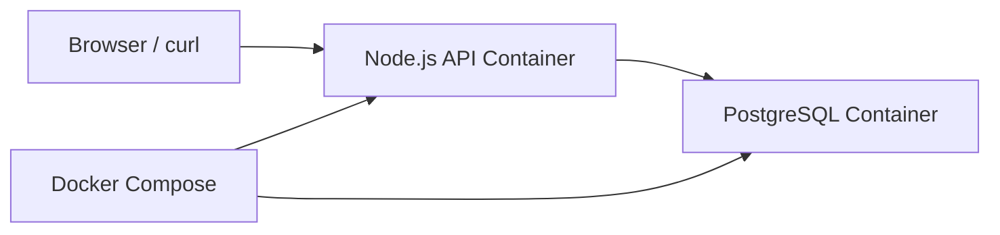

# Day 4: Docker Compose App with Database

## What We Are Building

Today we run two containers together:

- a Node.js API
- a PostgreSQL database

The app connects to the database using the Compose service name `db`.

This is the first project where students see that containers are not just isolated boxes. They can talk to each other through a Docker network.

## Why This Project Matters

Most real applications are not one container. They usually need:

- an API
- a database
- a cache
- a reverse proxy
- background workers
- observability sidecars

Docker Compose is a good local practice tool because it lets you describe multiple services in one file.

In real projects, this same thinking later becomes Kubernetes manifests, Helm charts, ECS task definitions, or Terraform modules.

## Architecture



## Folder Structure

```text
day-04-docker-compose-app-with-db/
├── README.md
├── compose.yaml
├── .env.example
├── app/
│   ├── Dockerfile
│   ├── package.json
│   └── server.js
├── db/
│   └── init.sql
└── screenshots/
    └── README.md
```

## Start the Project

```bash
cd 30-days-cloud-devops-projects/day-04-docker-compose-app-with-db
docker compose up --build
```

Open:

```text
http://localhost:3000
http://localhost:3000/health
http://localhost:3000/tasks
```

## Stop the Project

```bash
docker compose down
```

To remove the database volume also:

```bash
docker compose down -v
```

## Important Concept: Service Name as DNS

Inside Compose, the app connects to:

```text
db:5432
```

Not:

```text
localhost:5432
```

Why? Because `localhost` inside the app container means the app container itself. The database is a different container. Docker Compose gives every service name a DNS entry on the project network.

This is one of the most important beginner lessons.

## Useful Commands

```bash
docker compose ps
docker compose logs app
docker compose logs db
docker compose exec db psql -U devops -d devops_tasks
```

Inside Postgres:

```sql
select * from tasks;
```

## Break It Intentionally

Change this environment variable in `compose.yaml`:

```yaml
DB_HOST: db
```

to:

```yaml
DB_HOST: localhost
```

Restart:

```bash
docker compose up --build
```

The app should fail to connect to Postgres. Fix it back to `db`.

This is exactly the kind of mistake people make when moving from local apps to containers.

## Troubleshooting

### App starts before database is ready

The app includes retry logic. In real systems, startup timing matters. `depends_on` controls startup order, but it does not always mean the database is ready for queries.

### Port 3000 already used

Change the host port:

```yaml
ports:
  - "3001:3000"
```

Then open:

```text
http://localhost:3001
```

### Database data does not reset

Run:

```bash
docker compose down -v
docker compose up --build
```

The `-v` removes the named volume.

## Interview Explanation

> I built a Docker Compose project with a Node.js API and PostgreSQL database. The app connects to the database using Docker service discovery. I learned container networking, environment variables, volumes, logs, and how to troubleshoot app-to-database connectivity issues.

## Evidence

Capture:

- `docker compose up --build`
- `docker compose ps`
- `/health` endpoint
- `/tasks` endpoint showing database rows
- `docker compose logs app`
- intentional failure when `DB_HOST` is wrong
