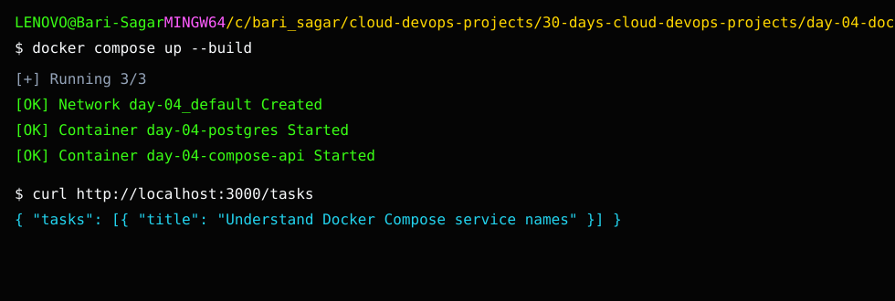

# Day 4 Screenshot Checklist

## Project output

This screenshot shows the completed project output used for verification.

Capture:

- `01-compose-up-build.png`
- `02-compose-ps.png`
- `03-health-endpoint.png`
- `04-tasks-endpoint.png`
- `05-postgres-query.png`
- `06-db-host-failure.png`
- `07-db-host-fixed.png`

Do not upload real database passwords from work. The password in this local project is only for local practice.
