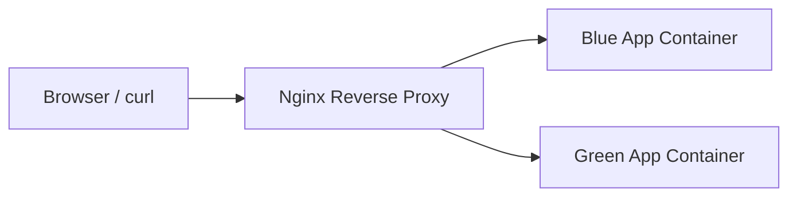

# Day 5: Nginx Reverse Proxy with Docker

## What We Are Building

Today we run Nginx as a reverse proxy in front of two backend containers:

- `app-blue`
- `app-green`

Nginx receives browser traffic on port `8080` and routes requests to the right backend service.

This is a very important concept because the same idea appears later in:

- Kubernetes Ingress
- AWS Application Load Balancer
- API Gateway
- service mesh routing
- blue/green deployments

## Why This Project Matters

When a user opens a website, they usually do not talk directly to the application process. Traffic often goes through a proxy or load balancer first.

That proxy can handle:

- routing
- TLS termination
- headers
- compression
- rate limiting
- health checks
- blue/green or canary routing

Today we keep it simple and focus on routing.

## Architecture



## Folder Structure

```text
day-05-nginx-reverse-proxy-docker/
├── README.md
├── compose.yaml
├── nginx/
│   └── default.conf
├── app-blue/
│   ├── Dockerfile
│   └── server.js
├── app-green/
│   ├── Dockerfile
│   └── server.js
└── screenshots/
    └── README.md
```

## Start the Project

```bash
cd 30-days-cloud-devops-projects/day-05-nginx-reverse-proxy-docker
docker compose up --build
```

Open:

```text
http://localhost:8080
http://localhost:8080/blue
http://localhost:8080/green
http://localhost:8080/health
```

## Stop the Project

```bash
docker compose down
```

## Important Concept: Nginx Talks to Service Names

In `nginx/default.conf`, we use:

```nginx
proxy_pass http://app-blue:3000;
```

Nginx can resolve `app-blue` because Docker Compose creates a network and DNS records for service names.

This is similar to how Kubernetes services are used inside a cluster.

## Useful Commands

```bash
docker compose ps
docker compose logs nginx
docker compose logs app-blue
docker compose logs app-green
```

Test with curl:

```bash
curl http://localhost:8080/blue
curl http://localhost:8080/green
curl http://localhost:8080/health
```

## Break It Intentionally

In `nginx/default.conf`, change:

```nginx
proxy_pass http://app-blue:3000;
```

to:

```nginx
proxy_pass http://wrong-service:3000;
```

Restart:

```bash
docker compose restart nginx
```

Now open `/blue`. You should see an upstream error. Fix the service name and restart Nginx.

## Troubleshooting

### Nginx shows 502 Bad Gateway

Common causes:

- backend container is not running
- wrong service name
- wrong backend port
- app crashed

Check:

```bash
docker compose ps
docker compose logs nginx
docker compose logs app-blue
```

### Port 8080 already used

Change:

```yaml
ports:
  - "8081:80"
```

Then open:

```text
http://localhost:8081
```

## Interview Explanation

> I built an Nginx reverse proxy in Docker Compose that routes traffic to two backend containers. This helped me understand service discovery, upstream routing, 502 errors, and the foundation of Kubernetes ingress and cloud load balancers.

## Evidence

Capture:

- `docker compose up --build`
- Nginx home route
- `/blue` route
- `/green` route
- `/health` route
- 502 error after intentionally breaking upstream
- fixed route after correcting upstream
