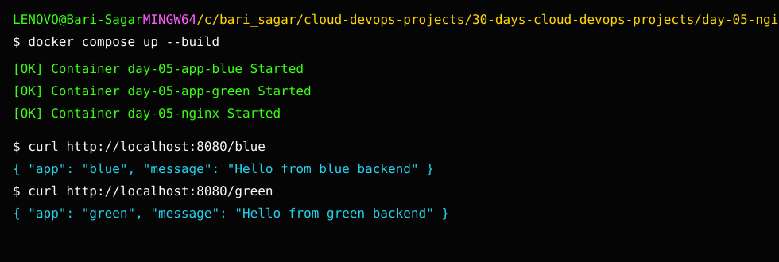

# Day 5 Screenshot Checklist

## Project output

This screenshot shows the completed project output used for verification.

Capture:

- `01-compose-up-build.png`
- `02-nginx-home.png`
- `03-blue-route.png`
- `04-green-route.png`
- `05-health-route.png`
- `06-broken-upstream-502.png`
- `07-fixed-upstream.png`

Reverse proxy troubleshooting screenshots are very useful because they show students how real routing failures look.
