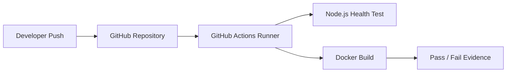
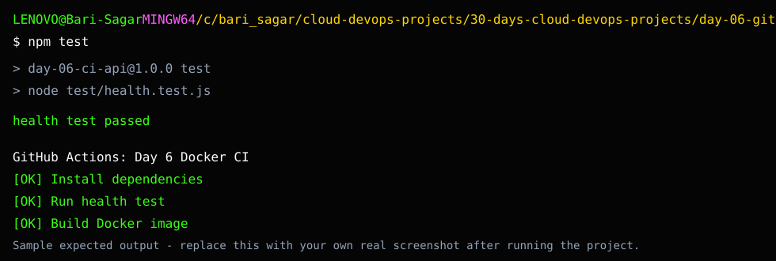

# Day 6: GitHub Actions CI for Docker App

## What We Are Building

Today we create a CI pipeline using GitHub Actions.

The workflow does three things:

1. checks out the repository
2. installs Node.js dependencies
3. runs a health test
4. builds a Docker image

This is the first step toward real CI/CD. We are not deploying yet. We are making sure a change is safe before it moves forward.

## Why This Project Matters

In real teams, engineers should not manually test everything after every change. CI gives fast feedback.

A good CI pipeline catches:

- broken application startup
- failing tests
- Dockerfile mistakes
- missing files
- syntax errors

I like to think of CI as the first gate. If the code cannot pass this gate, it should not go near production.

## Theory: Continuous Integration

Continuous Integration means every important code change should be checked automatically.

### Runner

A GitHub Actions runner is a temporary machine that executes workflow steps. In this project, GitHub provides an Ubuntu runner.

### Workflow

A workflow is the YAML file under `.github/workflows`. It defines when the automation should run and what jobs it should perform.

### Job

A job is a group of steps that run on a runner. Our job installs dependencies, runs a test, and builds a Docker image.

### Step

A step is one action inside a job. Examples: checkout code, setup Node.js, run tests, build Docker image.

### Feedback Loop

The real value of CI is fast feedback. If the health test or Docker build fails, the learner knows the change is unsafe before deployment.

## Architecture



## Folder Structure

```text
day-06-github-actions-docker-ci/
├── README.md
├── Dockerfile
├── .dockerignore
├── package.json
├── server.js
├── test/
│   └── health.test.js
└── screenshots/
    └── README.md
```

The active GitHub Actions workflow is here:

```text
.github/workflows/day-06-docker-ci.yml
```

## Sample Expected Screenshot

This is a sample expected-output reference, not real evidence from a laptop run. Use it to understand what success should look like, then capture your own screenshot.



## Run Locally

```bash
cd 30-days-cloud-devops-projects/day-06-github-actions-docker-ci
npm install
npm start
```

Open:

```text
http://localhost:3000
http://localhost:3000/health
```

## Run Test Locally

```bash
npm test
```

## Build Docker Image Locally

```bash
docker build -t day-06-ci-api .
```

## Trigger GitHub Actions

Push a change to GitHub:

```bash
git add .
git commit -m "Add Day 6 GitHub Actions Docker CI"
git push
```

Then open:

```text
GitHub repository -> Actions -> Day 6 Docker CI
```

## Break It Intentionally

In `server.js`, temporarily change the health response:

```js
status: 'ok'
```

to:

```js
status: 'broken'
```

Push the change or run:

```bash
npm test
```

The test should fail. Fix it back to `ok`.

This is exactly why CI exists: it catches mistakes before humans miss them.

## Troubleshooting

### GitHub Actions does not run

Check:

- workflow file is under `.github/workflows`
- file name ends with `.yml`
- branch was pushed
- path filter matches your changed files

### Docker build fails in CI

Common causes:

- wrong `COPY` path
- missing `package.json`
- app listens on different port
- Dockerfile command is wrong

### Tests pass locally but fail in CI

Check:

- Node version
- environment variables
- case-sensitive file paths
- missing files that were not committed

Linux CI runners are case-sensitive. Windows often hides case mistakes.

## Interview Explanation

> I built a GitHub Actions CI workflow that installs dependencies, runs a Node.js health test, and builds a Docker image. This validates application and container basics before deployment. I also intentionally broke the health response to verify the pipeline catches failures.

## Evidence

Capture:

- local `npm test`
- local Docker build
- GitHub Actions workflow success
- workflow logs showing test and build steps
- failed workflow after intentional break
- fixed workflow success
