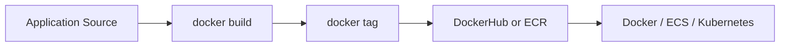
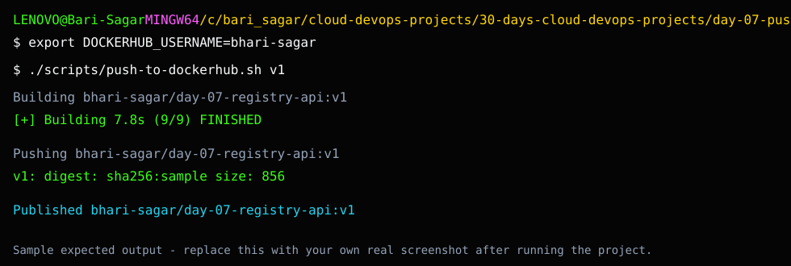

# Day 7: Push Docker Image to Registry

## What We Are Building

Today we build a Docker image and push it to a container registry.

In Day 3, we built an image locally. In Day 6, CI built an image inside GitHub Actions. Today we publish an image so another machine can pull and run it.

This is a big DevOps milestone.

Why? Because platforms like Kubernetes, ECS, and CI/CD systems do not use your local laptop image. They pull images from registries.

## Registry Options

This project explains two common paths:

- DockerHub for beginner-friendly public image publishing
- AWS ECR for cloud and production-style image publishing

You can use DockerHub first. ECR will make more sense after AWS IAM and CLI setup.

## Theory: Container Registry and Image Tags

A container registry is a storage system for Docker images.

### Repository

A repository stores images for one application. For example, `day-07-registry-api` is the repository name.

### Tag

A tag identifies a version of an image. `latest` is common, but it is not enough for production because it does not clearly explain what version is running.

### Push

`docker push` uploads an image from your machine or CI runner to the registry.

### Pull

`docker pull` downloads an image from the registry to another machine.

### Why Registries Matter

ECS, Kubernetes, and deployment servers do not know about your laptop image. They need to pull an image from a registry. That is why publishing is a key step between local Docker and real deployment.

## Architecture



## Folder Structure

```text
day-07-push-docker-image-to-registry/
├── README.md
├── Dockerfile
├── .dockerignore
├── package.json
├── server.js
├── scripts/
│   ├── push-to-dockerhub.sh
│   └── push-to-ecr.sh
└── screenshots/
    └── README.md
```

The manual GitHub Actions workflow is here:

```text
.github/workflows/day-07-publish-image.yml
```

## Sample Expected Screenshot

This is a sample expected-output reference, not real evidence from a laptop run. Use it to understand what success should look like, then capture your own screenshot.



## Run Locally

```bash
cd 30-days-cloud-devops-projects/day-07-push-docker-image-to-registry
npm start
```

Open:

```text
http://localhost:3000
http://localhost:3000/health
```

## Build Image

```bash
docker build -t day-07-registry-api:local .
```

Run:

```bash
docker run --rm -p 3000:3000 day-07-registry-api:local
```

## Push to DockerHub

Login:

```bash
docker login
```

Set your DockerHub username:

```bash
export DOCKERHUB_USERNAME=your-dockerhub-username
```

Run:

```bash
chmod +x scripts/push-to-dockerhub.sh
./scripts/push-to-dockerhub.sh v1
```

Pull and test from registry:

```bash
docker pull your-dockerhub-username/day-07-registry-api:v1
docker run --rm -p 3000:3000 your-dockerhub-username/day-07-registry-api:v1
```

## Push to AWS ECR

Prerequisites:

- AWS CLI configured
- ECR repository created or permission to create it
- Docker running

Set variables:

```bash
export AWS_REGION=ap-south-1
export ECR_REPOSITORY=day-07-registry-api
```

Run:

```bash
chmod +x scripts/push-to-ecr.sh
./scripts/push-to-ecr.sh v1
```

## GitHub Actions Publishing

The workflow is manual-only:

```text
Actions -> Day 7 Publish Docker Image -> Run workflow
```

Required GitHub secrets:

```text
DOCKERHUB_USERNAME
DOCKERHUB_TOKEN
```

Use a DockerHub access token, not your account password.

## Tagging Strategy

Do not only use `latest`.

Better tags:

```text
v1
v1.0.0
2026-06-07
git-sha
```

In production, tags help you roll back.

Example:

```bash
docker run company/app:v1.0.0
```

If the new version fails:

```bash
docker run company/app:v0.9.0
```

## Break It Intentionally

Try pushing without login:

```bash
docker logout
./scripts/push-to-dockerhub.sh v1
```

You should see an authentication error. Login again and retry.

This is useful because registry authentication errors are common in CI/CD.

## Troubleshooting

### `denied: requested access to the resource is denied`

Check:

- DockerHub username is correct
- repository name is correct
- `docker login` succeeded
- token has push permission

### ECR login fails

Check:

```bash
aws sts get-caller-identity
aws ecr describe-repositories --region ap-south-1
```

### Image runs locally but fails after pull

Check:

- correct tag
- correct port mapping
- platform architecture
- environment variables

## Interview Explanation

> I built a Docker image, tagged it properly, pushed it to DockerHub/ECR, pulled it back, and ran it from the registry. This helped me understand how CI/CD and container platforms consume images from registries instead of relying on local builds.

## Evidence

Capture:

- local Docker build
- DockerHub or ECR repository page
- successful push
- successful pull
- container running from pulled image
- GitHub Actions manual workflow, if configured
