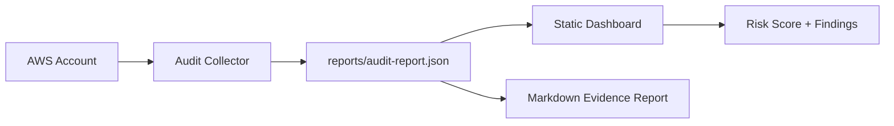

# Day 9 - AWS Security Audit Dashboard

Build a local AWS security audit dashboard that checks IAM, S3, security groups, CloudTrail, and cost guardrail signals, then turns the results into a risk score and evidence report.

## Project Objective

Most beginners create AWS resources. DevOps engineers also audit who has access, what is publicly exposed, and whether evidence exists.

This project creates a repeatable audit workflow:

1. Collect AWS security signals with AWS CLI.
2. Generate JSON and Markdown evidence reports.
3. Open a browser dashboard to review risks.
4. Save screenshots as portfolio evidence.

## Architecture



## What This Audits

- AWS caller identity
- IAM account summary
- Root MFA status signal
- Password policy status
- IAM users without MFA
- Access keys older than 90 days
- AdministratorAccess policy attachments
- S3 public access block and bucket policy signals
- Security groups open to the internet
- CloudTrail trail and logging status
- AWS Budget presence signal

## Folder Structure

```text
day-09-aws-security-audit-dashboard/
  README.md
  architecture.md
  dashboard/
    index.html
    styles.css
    app.js
  scripts/
    collect-audit.ps1
    collect-audit.sh
  reports/
    sample-audit-report.json
    sample-audit-report.md
  screenshots/
    evidence/
```

## Prerequisites

- AWS CLI configured
- Read-only permissions for IAM, S3, EC2, CloudTrail, and Budgets
- PowerShell on Windows or Bash on Linux/macOS

Recommended AWS managed policies for a learning account:

- `ReadOnlyAccess`
- `IAMReadOnlyAccess`
- `SecurityAudit`

## Run The Audit On Windows

```powershell
cd 30-days-cloud-devops-projects\day-09-aws-security-audit-dashboard
.\scripts\collect-audit.ps1
```

With a named AWS profile:

```powershell
.\scripts\collect-audit.ps1 -ProfileName your-profile-name -Region ap-south-1
```

## Run The Audit On Linux/macOS

```bash
cd 30-days-cloud-devops-projects/day-09-aws-security-audit-dashboard
bash scripts/collect-audit.sh
```

With a named AWS profile:

```bash
AWS_PROFILE=your-profile-name AWS_REGION=ap-south-1 bash scripts/collect-audit.sh
```

## Open The Dashboard

Use the sample report first:

```powershell
cd 30-days-cloud-devops-projects\day-09-aws-security-audit-dashboard\dashboard
python -m http.server 8089
```

Open:

```text
http://localhost:8089
```

The dashboard auto-loads `reports/sample-audit-report.json`. You can also upload your generated `reports/audit-report.json`.

## Evidence To Capture

Save screenshots in `screenshots/evidence/`:

- AWS CLI identity output
- Collector script completed
- Generated JSON report
- Generated Markdown report
- Dashboard overview
- Findings section

## Portfolio Summary

```text
Built an AWS Security Audit Dashboard that scans IAM, S3, security groups, CloudTrail, and budget guardrails, calculates a risk score, and generates evidence reports for DevOps security reviews.
```

## Cleanup

This project is read-only against AWS. It does not create or delete cloud resources.

Generated reports are ignored by Git:

- `reports/audit-report.json`
- `reports/audit-report.md`
