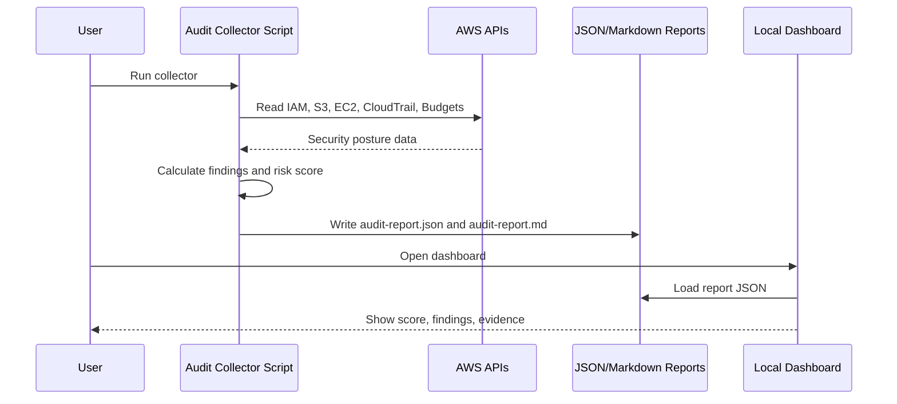

# Architecture - AWS Security Audit Dashboard

## Data Flow

## Risk Model

The project starts with a score of `100` and subtracts points for risky signals:

| Finding | Severity | Score Impact |
|---|---:|---:|
| CloudTrail not logging | Critical | -25 |
| Public S3 bucket signal | Critical | -25 |
| Security group open to internet | High | -15 |
| User without MFA | High | -12 |
| AdministratorAccess attached | High | -12 |
| Access key older than 90 days | Medium | -8 |
| Missing password policy | Medium | -8 |
| No budget found | Low | -5 |

## Design Decisions

- Static dashboard keeps the project easy to run.
- JSON report is the contract between collectors and UI.
- Markdown report is recruiter-friendly evidence.
- Collector scripts avoid changing AWS resources.
