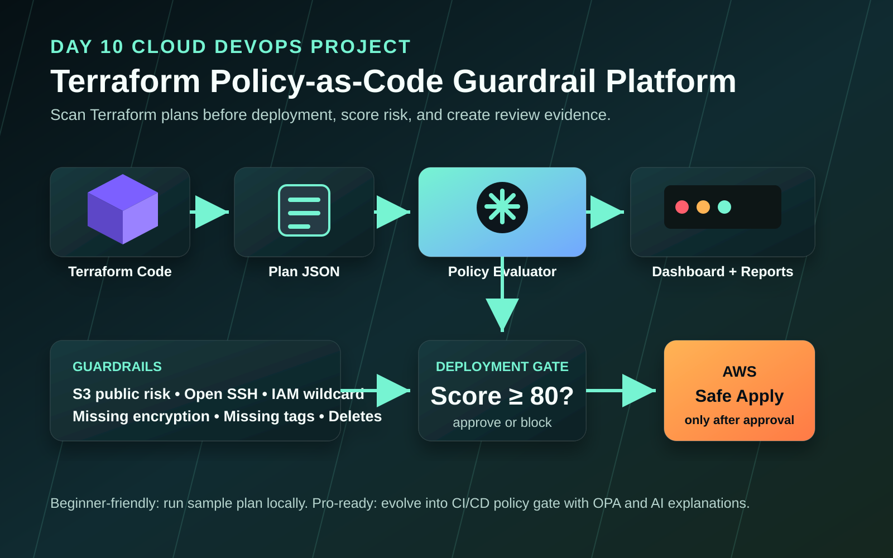
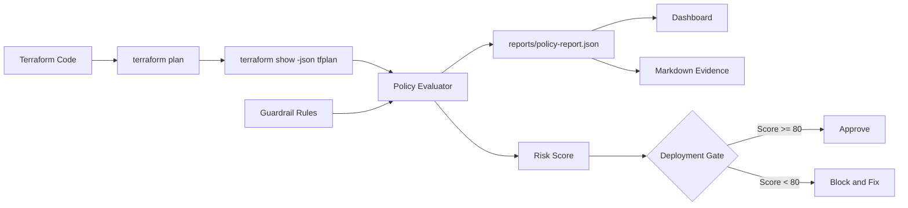

# Day 10 - Terraform Policy-as-Code Guardrail Platform

Build a policy-as-code platform that reviews Terraform plans before deployment, finds risky cloud changes, calculates a risk score, and creates evidence that explains whether the deployment should be approved or blocked.

## Project Objective

Terraform can create infrastructure quickly. A professional DevOps workflow also asks:

- Is this change secure?
- Is it tagged for ownership and cost?
- Is anything exposed to the internet?
- Is encryption enabled?
- Is this plan deleting anything important?
- Can a reviewer understand the risk before approving?

This project turns a Terraform plan into a security and governance report.

## What You Will Build

```text
Terraform plan JSON
  -> Policy evaluator
  -> Risk score
  -> JSON report
  -> Markdown evidence report
  -> Local dashboard
```

## Beginner Skills

- Understand Terraform plan output
- Learn why plan review matters before `terraform apply`
- Read JSON reports
- Run local Python scripts
- Capture dashboard evidence

## Pro-Level Skills

- Policy-as-code thinking
- Infrastructure governance
- Risk scoring
- CI/CD deployment gates
- OPA/Rego-style guardrails
- Human-readable AI-ready evidence reports

## Architecture





## Guardrails Included

| Guardrail | Severity | Why It Matters |
| --- | --- | --- |
| Public S3 bucket risk | Critical | Public storage exposure is a common breach pattern. |
| Security group open to internet | High/Critical | Open inbound access can expose workloads. |
| Wildcard IAM admin policy | Critical | `Action: *` and `Resource: *` breaks least privilege. |
| RDS encryption disabled | High | Databases should encrypt data at rest. |
| EBS/root volume encryption disabled | Medium | Compute storage should be encrypted. |
| Missing required tags | Medium | Ownership, cost, and audit evidence become weak. |
| Delete actions in plan | High | Destructive changes require human approval. |

## Folder Structure

```text
day-10-terraform-policy-guardrails/
  README.md
  architecture.md
  architecture.svg
  dashboard/
    index.html
    styles.css
    app.js
  policies/
    guardrails.json
    opa/
      terraform_guardrails.rego
  reports/
    sample-policy-report.json
    sample-policy-report.md
  scripts/
    evaluate_plan.py
    run-demo.ps1
    run-demo.sh
  terraform/
    sample-risky-plan.json
    sample-risky/
      main.tf
      variables.tf
  screenshots/
    README.md
    evidence/
```

## Prerequisites

Required:

- Python 3.10+

Optional:

- Terraform CLI
- OPA CLI

This project works without AWS credentials because the included sample plan is already exported as JSON.

## Quick Start

From the repository root:

```powershell
cd 30-days-cloud-devops-projects\day-10-terraform-policy-guardrails
python scripts\evaluate_plan.py --plan terraform\sample-risky-plan.json --rules policies\guardrails.json
```

Output:

```text
reports/policy-report.json
reports/policy-report.md
```

## Run On Linux/macOS

```bash
cd 30-days-cloud-devops-projects/day-10-terraform-policy-guardrails
python3 scripts/evaluate_plan.py --plan terraform/sample-risky-plan.json --rules policies/guardrails.json
```

## Open The Dashboard

```powershell
cd 30-days-cloud-devops-projects\day-10-terraform-policy-guardrails
python -m http.server 8090
```

Open:

```text
http://localhost:8090/dashboard/
```

The dashboard loads `reports/sample-policy-report.json` by default. You can also upload your generated `reports/policy-report.json`.

## How To Use With A Real Terraform Plan

Inside any Terraform project:

```powershell
terraform init
terraform plan -out=tfplan
terraform show -json tfplan > tfplan.json
```

Then run:

```powershell
python scripts\evaluate_plan.py --plan path\to\tfplan.json --rules policies\guardrails.json
```

## Deployment Gate Logic

The evaluator starts with a score of `100`.

- Critical findings subtract more points.
- High findings require review.
- Score below `80` blocks deployment.
- Score `80` or above can proceed with review notes.

This is how policy-as-code becomes a CI/CD quality gate.

## OPA/Rego Learning Path

The file `policies/opa/terraform_guardrails.rego` shows how the same ideas can be expressed in OPA/Rego.

Beginners can start with the Python evaluator.

Advanced learners can later run the same plan through OPA or Conftest.

## Evidence To Capture

Save screenshots in `screenshots/evidence/`:

- Evaluator script output
- Generated JSON report
- Generated Markdown report
- Dashboard overview
- Findings list
- Blocked deployment decision

## Portfolio Summary

```text
Built a Terraform Policy-as-Code Guardrail Platform that scans Terraform plans for public exposure, weak IAM, missing encryption, missing tags, and destructive changes, then generates a risk score, dashboard, and evidence report before deployment.
```

## Troubleshooting

### Dashboard does not load the report

Run the dashboard with a local HTTP server. Opening the HTML file directly can block `fetch()`.

```powershell
python -m http.server 8090
```

### No findings are shown

Confirm the plan JSON includes `planned_values` or `resource_changes`. Terraform plan JSON format is required.

### Terraform is not installed

Use the included sample plan:

```text
terraform/sample-risky-plan.json
```

## Cleanup

This project does not create cloud resources unless you choose to run the sample Terraform code yourself. The included demo uses a static plan JSON.
