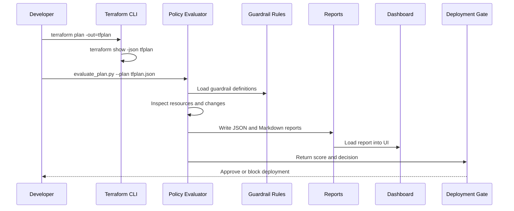

# Architecture - Terraform Policy-as-Code Guardrail Platform

## End-to-End Flow



## Why This Matters

Old DevOps pipelines often ask only:

```text
Did Terraform syntax pass?
```

Modern platform engineering asks:

```text
Should this infrastructure be allowed to exist?
```

That second question is what this project answers.

## Components

| Component | Purpose |
| --- | --- |
| Terraform plan JSON | The source of truth for proposed infrastructure changes. |
| Guardrail rules | Human-readable governance rules and score impacts. |
| Python evaluator | Local evaluator that works without paid tools or cloud access. |
| OPA/Rego example | Professional policy-as-code learning path. |
| Reports | Evidence artifacts for GitHub, interviews, and audits. |
| Dashboard | Visual review surface for beginners and stakeholders. |
| Deployment gate | Score-based decision that can later be used in CI/CD. |

## CI/CD Adoption Pattern

```text
pull request
  -> terraform fmt
  -> terraform validate
  -> terraform plan
  -> terraform show -json
  -> policy evaluator
  -> block if score < 80
  -> human approval
  -> terraform apply
```

## Risk Scoring

Start at `100`.

| Severity | Example | Impact |
| --- | --- | --- |
| Critical | Public S3 risk, wildcard admin IAM | -25 |
| High | Open SSH, RDS encryption disabled | -15 |
| Medium | Missing tags, EBS encryption disabled | -8 |
| Low | Informational hygiene issue | -4 |

## Beginner Path

1. Run the sample evaluator.
2. Read the Markdown report.
3. Open the dashboard.
4. Fix the sample Terraform code.
5. Re-run the evaluator and compare scores.

## Pro Path

1. Add more rules.
2. Add OPA/Conftest.
3. Run in GitHub Actions.
4. Block risky pull requests.
5. Store reports as build artifacts.
6. Use AI to explain risk and suggest fixes.
