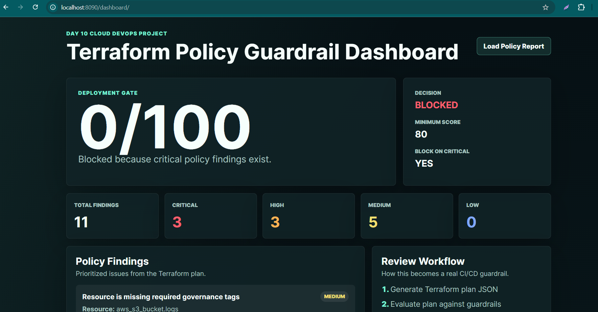
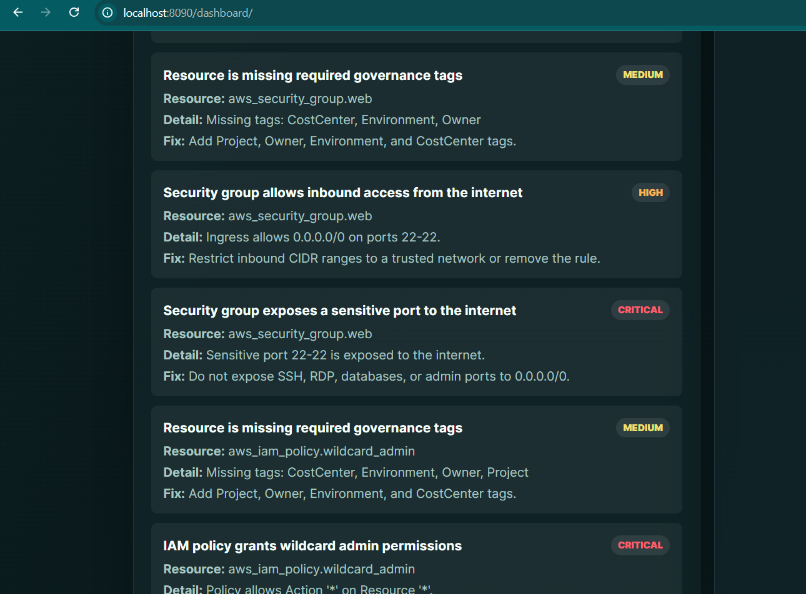
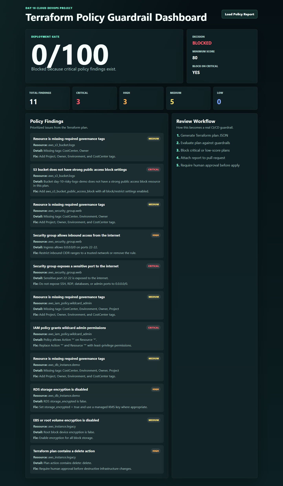

# Day 10 Screenshot Evidence

Capture screenshots that prove the Terraform policy guardrail workflow works end to end.

## Evidence Screenshots

### 1. Dashboard Overview

Dashboard overview showing score, blocked decision, and summary metrics.

[Open full image](./evidence/01-dashboard-overview.png)

### 2. Dashboard Findings

Dashboard findings list showing policy violations and recommended fixes.

[Open full image](./evidence/02-dashboard-findings.png)

### 3. Full Dashboard Preview

Full-page dashboard preview captured during local verification.

[Open full image](./evidence/dashboard-preview.png)

## Evidence Checklist

- Terraform plan JSON was evaluated.
- Risk score was calculated.
- Deployment decision was shown.
- JSON and Markdown reports were generated.
- Dashboard loaded the report successfully.
- Findings explain the resource, risk, and recommended fix.
