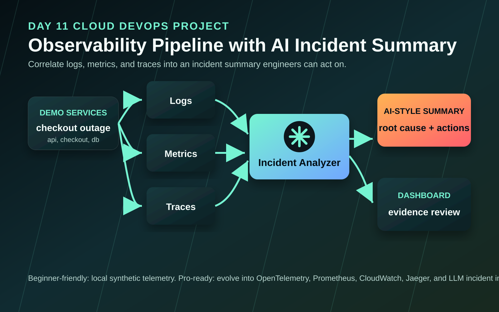
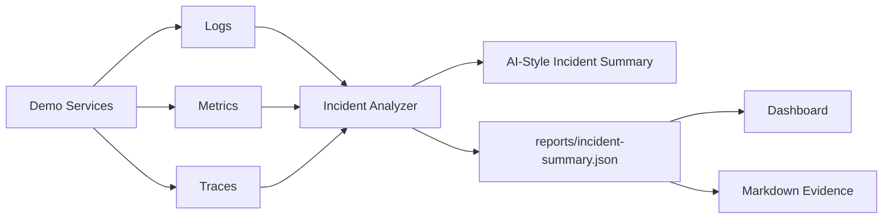

# Day 11 - Observability Pipeline with AI Incident Summary

Build a local observability pipeline that collects logs, metrics, and traces, then turns noisy telemetry into an AI-style incident summary with impact, probable root cause, timeline, and next actions.

## Project Objective

Modern DevOps is not only about deploying infrastructure. A strong engineer must also answer:

- What broke?
- When did it start?
- Which service is affected?
- What is the user impact?
- Which logs, metrics, and traces support the conclusion?
- What should we do next?

This project teaches observability by simulating a real incident and generating a structured incident summary.

## What You Will Build

```text
Synthetic app telemetry
  -> logs.jsonl
  -> metrics.jsonl
  -> traces.json
  -> incident analyzer
  -> JSON incident report
  -> Markdown incident report
  -> local dashboard
```

## Beginner Skills

- Understand logs, metrics, and traces
- Learn how incidents are investigated
- Read JSONL telemetry files
- Run Python scripts locally
- Open a dashboard and capture evidence

## Pro-Level Skills

- OpenTelemetry-style thinking
- Incident timeline reconstruction
- SLO and error budget awareness
- AI-assisted incident summarization
- Root cause hypothesis generation
- Human-in-the-loop remediation planning

## Architecture





## Incident Scenario

The demo simulates a checkout outage:

- `checkout-service` latency increases sharply.
- Error rate increases above the SLO threshold.
- Database connection pool errors appear in logs.
- Trace spans show slow `db.query` operations.
- The analyzer identifies the likely root cause and recommends next steps.

## Folder Structure

```text
day-11-observability-ai-incident-summary/
  README.md
  architecture.md
  architecture.svg
  dashboard/
    index.html
    styles.css
    app.js
  reports/
    sample-incident-summary.json
    sample-incident-summary.md
  scripts/
    generate_telemetry.py
    analyze_incident.py
    run-demo.ps1
    run-demo.sh
  telemetry/
    sample-logs.jsonl
    sample-metrics.jsonl
    sample-traces.json
  screenshots/
    README.md
    evidence/
```

## Prerequisites

Required:

- Python 3.10+

Optional:

- OpenTelemetry SDK
- Grafana/Prometheus
- CloudWatch
- Any LLM provider for future AI integration

This project does not require cloud credentials or paid tools.

## Quick Start On Windows

From the repository root:

```powershell
cd 30-days-cloud-devops-projects\day-11-observability-ai-incident-summary
.\scripts\run-demo.ps1
```

Or run the steps manually:

```powershell
python scripts\generate_telemetry.py
python scripts\analyze_incident.py --logs telemetry\sample-logs.jsonl --metrics telemetry\sample-metrics.jsonl --traces telemetry\sample-traces.json
```

## Quick Start On Linux/macOS

```bash
cd 30-days-cloud-devops-projects/day-11-observability-ai-incident-summary
bash scripts/run-demo.sh
```

## Open The Dashboard

```powershell
python -m http.server 8091
```

Open:

```text
http://localhost:8091/dashboard/
```

The dashboard loads `reports/sample-incident-summary.json` by default.

## What The Analyzer Produces

The analyzer creates:

```text
reports/sample-incident-summary.json
reports/sample-incident-summary.md
```

The report includes:

- Incident title
- Severity
- Impacted services
- User impact
- SLO status
- Probable root cause
- Supporting evidence
- Timeline
- Recommended commands
- Remediation plan
- Verification checklist

## How This Connects To Real AI

This project uses a deterministic analyzer so everyone can run it for free.

In a real platform, the same telemetry summary can be sent to an LLM with a prompt like:

```text
Given these logs, metrics, traces, and timeline events, summarize the incident, identify probable root cause, list evidence, and recommend safe next actions.
```

The important DevOps habit is not blindly trusting AI. The habit is giving AI structured telemetry and asking it to explain its reasoning with evidence.

## Evidence To Capture

Save screenshots in `screenshots/evidence/`:

- Demo script output
- Generated Markdown incident report
- Dashboard overview
- Timeline section
- Recommended actions section

## Troubleshooting

### Dashboard does not load

Use a local HTTP server. Opening `index.html` directly can block browser `fetch()`.

```powershell
python -m http.server 8091
```

### Analyzer says telemetry files are missing

Run telemetry generation first:

```powershell
python scripts\generate_telemetry.py
```

### No incident detected

Check that you are using the included sample telemetry files. The sample data intentionally contains a checkout incident.