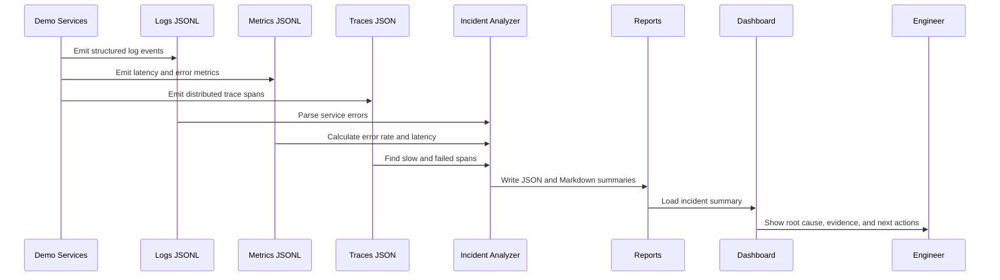

# Architecture - Observability Pipeline with AI Incident Summary

## End-to-End Flow



## Why This Matters

Old monitoring often stopped at alerts:

```text
CPU high
Errors high
Latency high
```

Modern observability answers a better question:

```text
What changed, who is impacted, and what evidence supports the next action?
```

## Components

| Component | Purpose |
| --- | --- |
| Logs | Discrete events with severity, service, message, and trace ID. |
| Metrics | Numeric signals such as latency, request count, and error rate. |
| Traces | Request path across services and dependencies. |
| Analyzer | Correlates telemetry and generates incident intelligence. |
| Reports | JSON for machines and Markdown for human evidence. |
| Dashboard | Visual incident review page for engineers and stakeholders. |

## AI Adoption Pattern

```text
telemetry collection
  -> normalize signals
  -> identify anomalies
  -> summarize evidence
  -> generate next actions
  -> human approves remediation
```

## Beginner Path

1. Generate sample telemetry.
2. Open the log, metric, and trace files.
3. Run the analyzer.
4. Read the Markdown summary.
5. Open the dashboard.
6. Capture evidence screenshots.

## Pro Path

1. Replace sample telemetry with OpenTelemetry SDK data.
2. Send metrics to Prometheus.
3. Send traces to Jaeger or Tempo.
4. Send logs to CloudWatch or Loki.
5. Use an LLM to generate summaries from structured evidence.
6. Add human approval before remediation commands run.