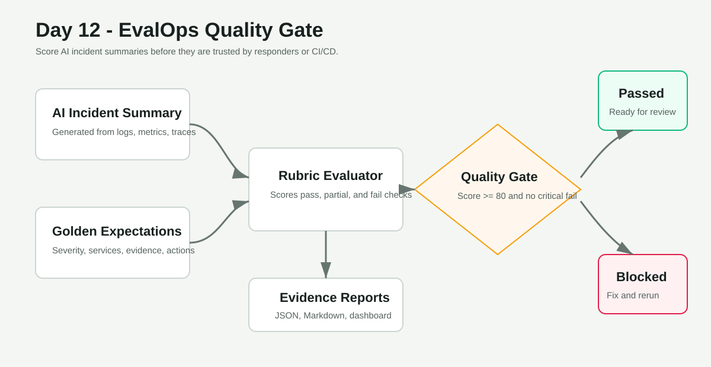
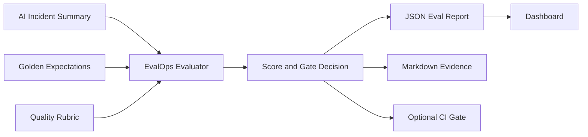

# Day 12 - EvalOps Quality Gate for AI Incident Summaries

Build a local EvalOps quality gate that scores an AI-style incident summary against golden expectations, then produces a pass or block decision before the summary is trusted by responders.

## Project Objective

Day 11 generated an incident summary from logs, metrics, and traces. Day 12 asks the next production question:

- Is the summary correct?
- Did it identify the right severity?
- Did it name the real impacted services?
- Did it explain the root cause with supporting evidence?
- Did it recommend useful next actions?
- Did it avoid hallucinated claims?
- Should this summary pass a release or incident-response quality gate?

This project teaches EvalOps by turning AI output into something you can test, score, and defend with evidence.

## What You Will Build

```text
Generated incident summary
  -> golden incident expectations
  -> rubric-based evaluator
  -> quality score
  -> pass/block gate decision
  -> JSON eval report
  -> Markdown eval report
  -> local dashboard
```

## Beginner Skills

- Read JSON incident reports
- Understand golden test cases
- Run a local Python evaluator
- Interpret pass, partial, and fail checks
- Open a dashboard and capture evidence

## Pro-Level Skills

- EvalOps for AI systems
- AI output regression testing
- Hallucination detection guardrails
- Quality gates in CI/CD
- Human-in-the-loop incident response
- Evidence-based AI governance

## Architecture





## Quality Gate Scenario

The demo evaluates a generated checkout incident summary. A good summary should:

- Classify the incident as `SEV1`.
- Include `checkout-service` and `postgres` as impacted services.
- Explain database connection pool saturation as the probable root cause.
- Cite telemetry evidence such as errors, p95 latency, failed traces, and slow postgres spans.
- Recommend useful commands and remediation actions.
- Avoid unsupported claims such as DNS, Redis, or regional cloud outages.

The gate passes only when the score is at least `80` and no critical check fails.

## Folder Structure

```text
day-12-evalops-ai-quality-gate/
  README.md
  architecture.md
  architecture.svg
  dashboard/
    index.html
    styles.css
    app.js
  evals/
    golden-incidents.json
  reports/
    sample-eval-report.json
    sample-eval-report.md
  scripts/
    evaluate_summary.py
    run-demo.ps1
    run-demo.sh
  screenshots/
    README.md
    evidence/
  summaries/
    sample-generated-incident-summary.json
    weak-generated-incident-summary.json
```

## Prerequisites

Required:

- Python 3.10+

Optional:

- GitHub Actions for a future CI quality gate
- Any LLM provider for future live summary generation

This project does not require cloud credentials or paid tools.

## Quick Start On Windows

From this folder:

```powershell
.\scripts\run-demo.ps1
```

Or run the evaluator directly:

```powershell
python scripts\evaluate_summary.py `
  --summary summaries\sample-generated-incident-summary.json `
  --golden evals\golden-incidents.json `
  --output-json reports\sample-eval-report.json `
  --output-md reports\sample-eval-report.md
```

Expected result:

```text
Eval score: 100.0
Decision: passed
Gate: minimum score 80
JSON report: reports\sample-eval-report.json
Markdown report: reports\sample-eval-report.md
```

## Quick Start On Linux Or macOS

```bash
chmod +x scripts/run-demo.sh
./scripts/run-demo.sh
```

## Open The Dashboard

For best browser loading behavior, serve the folder locally:

```powershell
python -m http.server 8120
```

Then open:

```text
http://127.0.0.1:8120/dashboard/
```

The dashboard loads `reports/sample-eval-report.json` by default. You can also upload another eval report JSON file.

## Try A Failing Summary

Run the same evaluator against the weak summary:

```powershell
python scripts\evaluate_summary.py `
  --summary summaries\weak-generated-incident-summary.json `
  --golden evals\golden-incidents.json `
  --output-json reports\weak-eval-report.json `
  --output-md reports\weak-eval-report.md
```

You should see a blocked decision because the weak summary uses the wrong severity, misses key evidence, and invents unsupported causes.

## Enforce The Gate Like CI

Use `--enforce-gate` when you want the command to exit with a non-zero code if quality is too low:

```powershell
python scripts\evaluate_summary.py `
  --summary summaries\weak-generated-incident-summary.json `
  --golden evals\golden-incidents.json `
  --enforce-gate
```

That behavior is useful in CI because the pipeline can fail before low-quality AI output is shipped or trusted.

## Evidence Checklist

Capture screenshots of:

- The passing evaluator command.
- `reports/sample-eval-report.md`.
- The dashboard score and decision.
- The weak summary blocked result.
- Your own short note explaining why EvalOps matters.

## Break And Fix Practice

Break it:

1. Edit `summaries/weak-generated-incident-summary.json`.
2. Change the probable root cause to an unsupported claim.
3. Run the evaluator with `--enforce-gate`.
4. Confirm the gate blocks the report.

Fix it:

1. Restore the correct root cause.
2. Add missing impacted services and evidence.
3. Run the evaluator again.
4. Confirm the gate passes.

## Interview Talking Points

- "I did not just generate an AI incident summary. I tested it against golden expectations."
- "The quality gate checks severity, services, root cause, SLO evidence, actionability, structure, and hallucination risk."
- "A weak summary can be blocked automatically before it reaches responders or CI."
- "This is the same pattern teams use for AI output regression testing and governance."

## Cleanup

This project only creates local report files. To reset generated output, delete non-sample files from `reports/`.