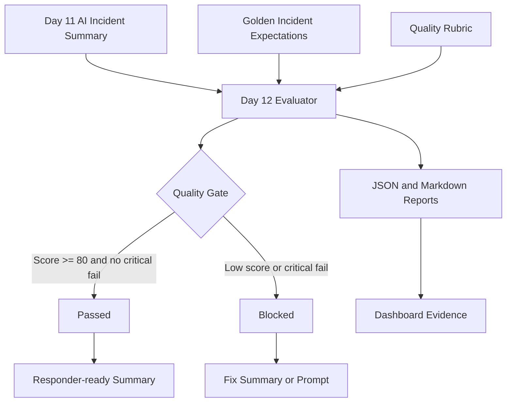

# Day 12 Architecture

The Day 12 project adds an EvalOps layer after the Day 11 incident summarizer.

## Flow

```text
Generated incident summary
  -> evaluator loads golden expectations
  -> evaluator applies the quality rubric
  -> evaluator scores each check
  -> evaluator returns passed or blocked
  -> reports and dashboard show the evidence
```

## Components

| Component | Purpose |
| --- | --- |
| `summaries/sample-generated-incident-summary.json` | A strong AI-style summary that should pass the gate. |
| `summaries/weak-generated-incident-summary.json` | A weak summary used to prove the gate can block bad output. |
| `evals/golden-incidents.json` | Expected severity, services, root cause terms, evidence terms, and forbidden claims. |
| `scripts/evaluate_summary.py` | Rubric evaluator that produces score, findings, and gate decision. |
| `reports/sample-eval-report.json` | Machine-readable quality report. |
| `reports/sample-eval-report.md` | Human-readable evidence report. |
| `dashboard/` | Browser dashboard for score, decision, and failed checks. |

## Mermaid Diagram



## Why This Matters

AI-generated operational output can be helpful, but responders need reliable evidence. EvalOps gives teams a repeatable way to check whether the output is accurate enough for human review, CI quality gates, or governance reporting.