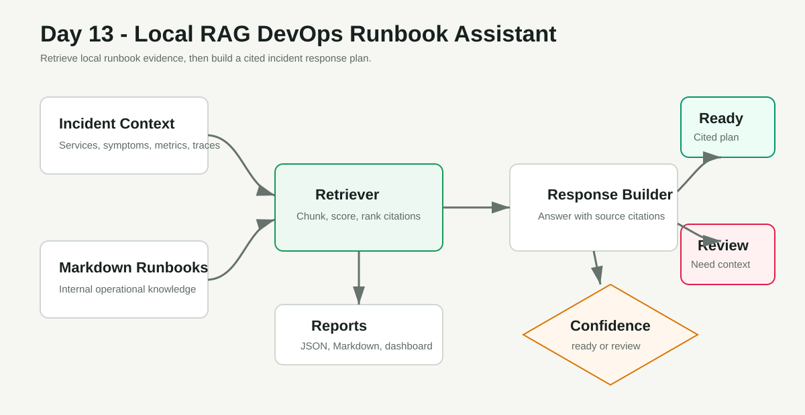
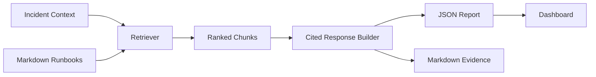

# Day 13 - Local RAG DevOps Runbook Assistant

Build a local retrieval-augmented generation style assistant that reads incident context, retrieves relevant runbook passages, and produces a cited response plan without using a paid AI API.

## Project Objective

Day 11 created an incident summary. Day 12 evaluated whether that summary was trustworthy. Day 13 adds the next production skill: using internal knowledge to guide the responder.

A strong DevOps engineer should be able to answer:

- Which runbook applies to this incident?
- Which symptoms match known failure modes?
- What should be checked first?
- What mitigation is safe?
- How do we verify recovery?
- Which source document supports each recommendation?

This project teaches the RAG pattern locally by retrieving from markdown runbooks and producing an evidence-backed incident response.

## What You Will Build

```text
Incident context JSON
  -> local runbook knowledge base
  -> lightweight retrieval engine
  -> ranked citations
  -> response plan
  -> JSON report
  -> Markdown report
  -> local dashboard
```

## Beginner Skills

- Read incident context from JSON
- Store runbooks as markdown knowledge
- Run a local retrieval script
- Understand citations and source grounding
- Open a dashboard and capture evidence

## Pro-Level Skills

- RAG architecture for operations
- Knowledge base chunking
- Retrieval scoring and confidence checks
- Cited incident response generation
- Human-in-the-loop runbook automation
- Governance-friendly AI output design

## Architecture





## Scenario

The demo incident describes checkout errors, elevated latency, failed traces, and postgres connection pressure. The assistant should retrieve runbooks about:

- Database connection pool saturation
- Checkout latency triage
- Safe rollback decisions
- SLO burn-rate alerting

The response is considered strong when it includes cited evidence, immediate checks, mitigation steps, verification steps, and escalation notes.

## Folder Structure

```text
day-13-rag-devops-runbook-assistant/
  README.md
  architecture.md
  architecture.svg
  dashboard/
    index.html
    styles.css
    app.js
  incidents/
    sample-checkout-incident.json
    vague-incident.json
  knowledge-base/
    runbooks/
      checkout-latency-triage.md
      database-connection-pool-saturation.md
      safe-rollback.md
      slo-burn-rate-alerts.md
      nodejs-memory-pressure.md
  reports/
    sample-rag-response.json
    sample-rag-response.md
  scripts/
    runbook_assistant.py
    run-demo.ps1
    run-demo.sh
  screenshots/
    README.md
    evidence/
```

## Prerequisites

Required:

- Python 3.10+

Optional:

- Real incident summaries from Day 11
- Eval criteria from Day 12
- A future vector database or LLM provider

This project does not require cloud credentials, Docker, or paid tools.

## Quick Start On Windows

From this folder:

```powershell
.\scripts\run-demo.ps1
```

Or run the assistant directly:

```powershell
python scripts\runbook_assistant.py `
  --incident incidents\sample-checkout-incident.json `
  --knowledge-base knowledge-base\runbooks `
  --output-json reports\sample-rag-response.json `
  --output-md reports\sample-rag-response.md
```

Expected result:

```text
Decision: answer_ready
Confidence: high
Top source: database-connection-pool-saturation.md
JSON report: reports\sample-rag-response.json
Markdown report: reports\sample-rag-response.md
```

## Quick Start On Linux Or macOS

```bash
chmod +x scripts/run-demo.sh
./scripts/run-demo.sh
```

## Open The Dashboard

For best browser loading behavior, serve the folder locally:

```powershell
python -m http.server 8130
```

Then open:

```text
http://127.0.0.1:8130/dashboard/
```

The dashboard loads `reports/sample-rag-response.json` by default. You can also upload another response JSON file.

## Try A Low-Confidence Incident

Run the assistant against vague context:

```powershell
python scripts\runbook_assistant.py `
  --incident incidents\vague-incident.json `
  --knowledge-base knowledge-base\runbooks `
  --output-json reports\vague-rag-response.json `
  --output-md reports\vague-rag-response.md
```

You should see `needs_human_review` because the incident does not contain enough matching evidence for a confident runbook answer.

## Enforce Confidence Like CI

Use `--enforce-confidence` when you want the command to exit with a non-zero code if the assistant cannot produce a confident response:

```powershell
python scripts\runbook_assistant.py `
  --incident incidents\vague-incident.json `
  --knowledge-base knowledge-base\runbooks `
  --enforce-confidence
```

That behavior is useful when a workflow should block automation and ask a human to enrich the incident context.

## Evidence Checklist

Capture screenshots of:

- The successful runbook assistant command.
- `reports/sample-rag-response.md` with citations.
- The dashboard retrieval view.
- The vague incident returning `needs_human_review`.
- Your own short note explaining why citations matter in operations.

## Break And Fix Practice

Break it:

1. Edit `incidents/vague-incident.json`.
2. Remove specific services, symptoms, and metrics.
3. Run the assistant with `--enforce-confidence`.
4. Confirm it refuses to produce a confident answer.

Fix it:

1. Add specific services such as `checkout-service` and `postgres`.
2. Add symptoms such as `connection pool exhausted`, `503`, `p95 latency`, and `failed traces`.
3. Run the assistant again.
4. Confirm it retrieves the right runbooks.

## Interview Talking Points

- "I built a local RAG-style assistant over DevOps runbooks."
- "The response is grounded in citations, not a free-form guess."
- "Low-confidence incidents are routed to human review instead of being over-automated."
- "This pattern can later be upgraded to embeddings, a vector database, and a real LLM."

## Cleanup

This project only creates local report files. To reset generated output, delete non-sample files from `reports/`.