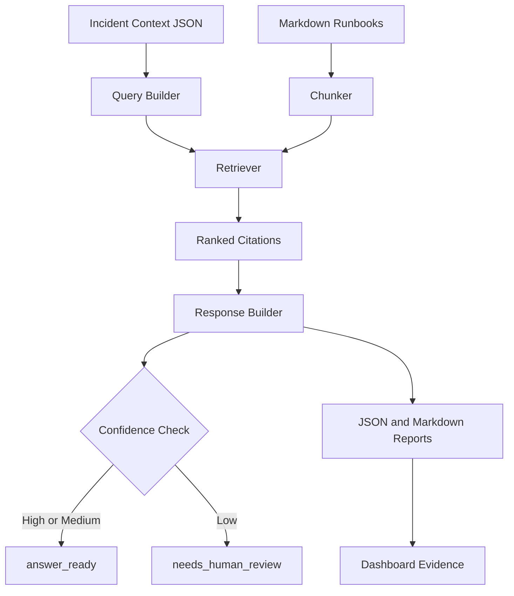

# Day 13 Architecture

The Day 13 project adds a retrieval layer between incident context and response planning.

## Flow

```text
Incident JSON
  -> extract query terms
  -> chunk markdown runbooks
  -> score chunks by overlap and operational keywords
  -> keep top citations
  -> build a response plan
  -> write JSON and Markdown reports
  -> render dashboard evidence
```

## Components

| Component | Purpose |
| --- | --- |
| `incidents/sample-checkout-incident.json` | Detailed incident context that should retrieve strong runbooks. |
| `incidents/vague-incident.json` | Weak incident context used to prove the assistant can ask for human review. |
| `knowledge-base/runbooks/` | Local markdown runbooks used as the retrieval corpus. |
| `scripts/runbook_assistant.py` | Lightweight RAG-style retriever and response builder. |
| `reports/sample-rag-response.json` | Machine-readable response with citations and confidence. |
| `reports/sample-rag-response.md` | Human-readable evidence report. |
| `dashboard/` | Browser dashboard for retrieved chunks, answer, and next actions. |

## Mermaid Diagram



## Why This Matters

RAG is useful in DevOps when teams have internal runbooks, past incident notes, architecture decisions, or postmortems. The key habit is grounding recommendations in retrieved sources so responders can inspect the evidence before acting.