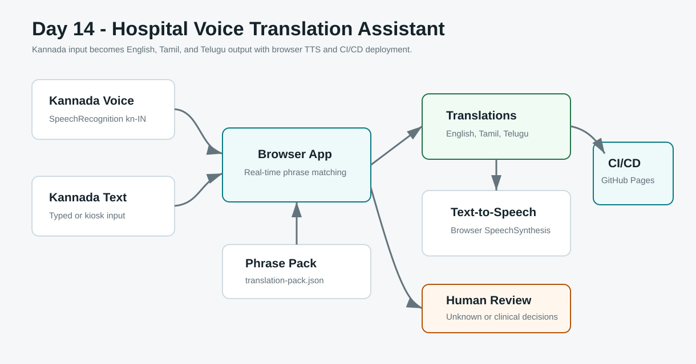
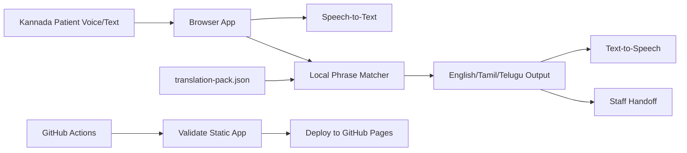

# Day 14 - Hospital Voice Translation Assistant

Build a real-time browser prototype for hospital communication where a Kannada-speaking patient can speak or type a basic phrase and staff can hear the meaning in English, Tamil, and Telugu.

## Project Objective

Hospitals often support patients who do not share a language with reception staff, nurses, or doctors. A safe DevOps-minded solution must do more than translate text. It needs clear safety limits, fast response, privacy awareness, deployment automation, and a path to production controls.

This project creates a static web app that demonstrates:

- Kannada speech or text input.
- Real-time phrase matching for common hospital needs.
- English, Tamil, and Telugu output.
- Browser text-to-speech playback.
- Urgent symptom highlighting.
- Handoff notes for staff.
- CI/CD deployment through GitHub Actions and GitHub Pages.

## Clinical Safety Boundary

This is a learning prototype, not a certified medical translator.

Use it only for basic communication support in demos. Emergency symptoms, consent, diagnosis, treatment instructions, medication decisions, and discharge instructions require a clinician and a qualified human interpreter.

The demo does not store patient data and should not be used with real protected health information.

## What You Will Build

```text
Kannada patient speech or text
  -> browser speech recognition
  -> local hospital phrase matcher
  -> English, Tamil, Telugu translations
  -> browser text-to-speech
  -> staff handoff log
  -> static site deployment
  -> GitHub Actions CI/CD
```

## Beginner Skills

- Build a static HTML/CSS/JavaScript app
- Use browser speech recognition where supported
- Use browser text-to-speech
- Work with JSON phrase data
- Run a validation script locally
- Deploy a static site with GitHub Actions

## Pro-Level Skills

- Healthcare safety boundary design
- Human-in-the-loop escalation
- Multilingual UX for hospital operations
- Static app CI/CD with GitHub Pages
- Privacy-first demo architecture
- Release validation before deployment

## Architecture





## Folder Structure

```text
day-14-hospital-voice-translator/
  README.md
  architecture.md
  architecture.svg
  app/
    index.html
    styles.css
    app.js
    translation-pack.json
    .nojekyll
  reports/
    sample-validation-report.json
    sample-validation-report.md
  scripts/
    validate_app.py
    run-demo.ps1
    run-demo.sh
  screenshots/
    README.md
    evidence/
```

## Quick Start On Windows

From this folder:

```powershell
.\scripts\run-demo.ps1
```

Then serve the app locally:

```powershell
python -m http.server 8140
```

Open:

```text
http://127.0.0.1:8140/app/
```

## Quick Start On Linux Or macOS

```bash
chmod +x scripts/run-demo.sh
./scripts/run-demo.sh
python3 -m http.server 8140
```

Then open:

```text
http://127.0.0.1:8140/app/
```

## Browser Notes

- Speech recognition works best in Chrome or Edge.
- Kannada speech input uses `kn-IN` when the browser supports it.
- Tamil and Telugu text-to-speech depends on voices installed in the browser or operating system.
- Text input works even if voice input is unavailable.

## CI/CD Deployment

This project includes a GitHub Actions workflow:

```text
.github/workflows/day-14-hospital-voice-translator-pages.yml
```

The workflow:

1. Runs the static app validation script.
2. Uploads `30-days-cloud-devops-projects/day-14-hospital-voice-translator/app` as a GitHub Pages artifact.
3. Deploys the app through GitHub Pages when changes land on `main`.

Before the first deployment, set repository Pages source to **GitHub Actions** in GitHub repository settings.

## Sample Kannada Phrases

Try these:

| Kannada | English |
| --- | --- |
| `ನನಗೆ ಹೊಟ್ಟೆ ನೋವು ಇದೆ` | I have stomach pain. |
| `ನನಗೆ ಜ್ವರ ಇದೆ` | I have a fever. |
| `ನನಗೆ ಎದೆ ನೋವು ಇದೆ` | I have chest pain. Please call a doctor immediately. |
| `ನನಗೆ ಉಸಿರಾಟ ಕಷ್ಟ ಆಗುತ್ತಿದೆ` | I am having difficulty breathing. Please help immediately. |
| `ನನಗೆ ನೀರು ಬೇಕು` | I need water. |

## Evidence Checklist

Capture screenshots of:

- Local validation command passing.
- Browser app translating Kannada to English, Tamil, and Telugu.
- Text-to-speech buttons visible.
- Urgent symptom highlighting for chest pain or breathing difficulty.
- GitHub Actions workflow success.
- GitHub Pages deployment URL.

## Break And Fix Practice

Break it:

1. Remove the Telugu translation from one phrase in `app/translation-pack.json`.
2. Run `python scripts\validate_app.py --strict`.
3. Confirm validation fails.

Fix it:

1. Restore the missing translation.
2. Run validation again.
3. Confirm CI would pass before deployment.

## Production Upgrade Path

For a real hospital deployment, this prototype should become:

- Certified medical translation workflow with qualified interpreter fallback.
- Consent-aware conversation mode.
- No local storage of patient identifiers unless approved by policy.
- Encrypted API calls and audit logging.
- Role-based access control for staff.
- Clinical review for all phrase packs.
- Monitoring, incident response, and rollback runbooks.
- Accessibility testing across patient kiosks and tablets.

## Interview Talking Points

- "I built a healthcare-focused multilingual voice assistant prototype."
- "The app translates Kannada hospital phrases to English, Tamil, and Telugu with text-to-speech."
- "The safety boundary is explicit: urgent and clinical decisions require staff and qualified interpreters."
- "GitHub Actions validates and deploys the static app through CI/CD."