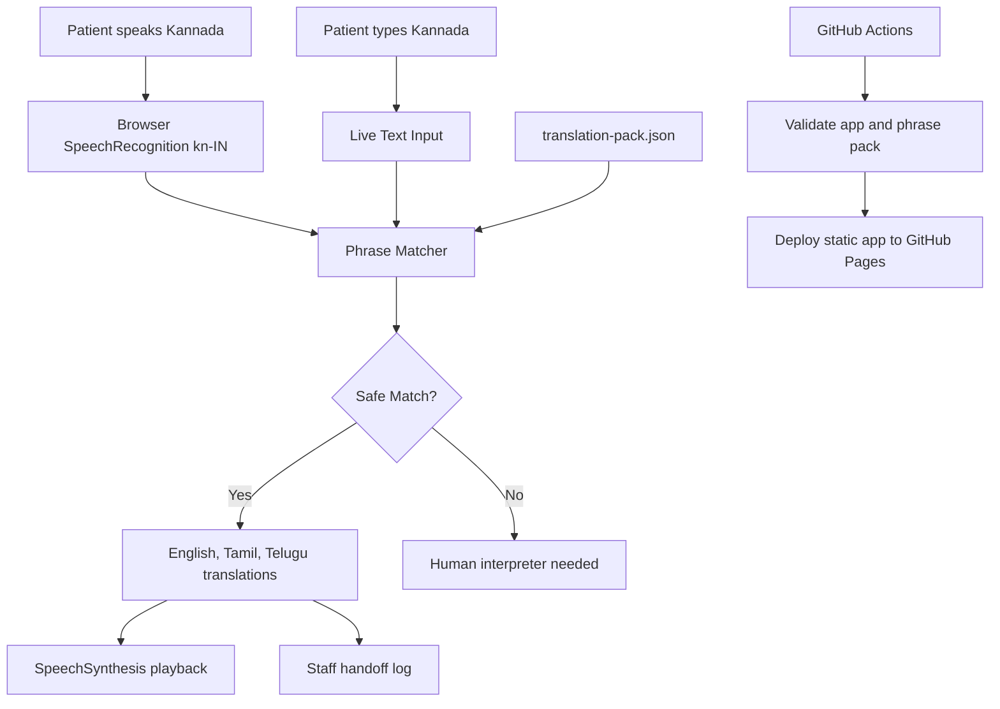

# Day 14 Architecture

Day 14 is a browser-first hospital communication prototype. It keeps the demo local and privacy-conscious while showing how the same idea can later become a production healthcare workflow.

## Flow

```text
Kannada patient speech or text
  -> browser speech recognition or typed input
  -> local phrase matcher
  -> English, Tamil, Telugu output
  -> browser text-to-speech
  -> staff handoff log
  -> GitHub Actions validation
  -> GitHub Pages deployment
```

## Components

| Component | Purpose |
| --- | --- |
| `app/index.html` | Static browser interface for staff and patient interaction. |
| `app/app.js` | Speech recognition, phrase matching, TTS, handoff log, and UI state. |
| `app/translation-pack.json` | Kannada source phrases and English/Tamil/Telugu translations. |
| `scripts/validate_app.py` | CI validation for static files and translation completeness. |
| `reports/sample-validation-report.*` | Evidence that the app passes local validation. |
| `.github/workflows/day-14-hospital-voice-translator-pages.yml` | CI/CD pipeline for GitHub Pages deployment. |

## Mermaid Diagram



## Safety Design

The app intentionally uses a controlled phrase pack rather than pretending to be a complete medical translator. Unknown or weakly matched phrases produce a human-interpreter fallback. Urgent phrases such as chest pain and breathing difficulty are highlighted for staff escalation.